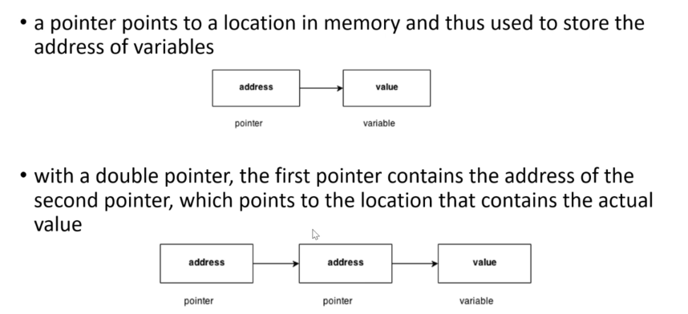
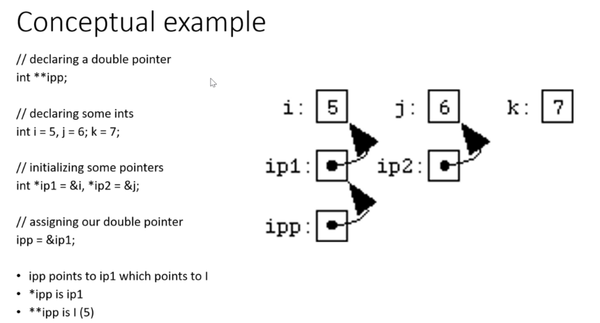
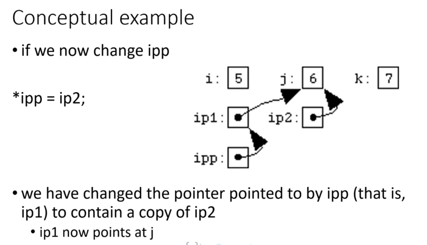
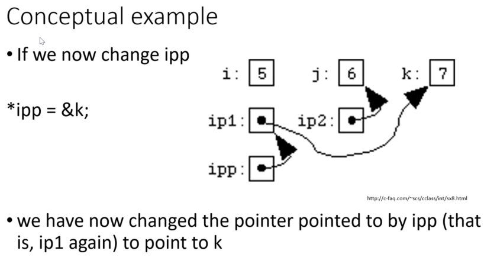

# Pointers

## Indirection

#### &#x20;is the ability to reference something using a name,reference or container,instead of the value itself.the most common form of indirection is the act of manipulating a value through its memory address.

#### a pointer provides an indirect means of accessing the value of a particular data item a variable whose value is a memory address.

C provides a remarkably useful type of variable called a pointer, a variable that stores a memory address. its value is the address of another location in memory that can contain a value.

.png>)

pointers allow functions to modify data passed to them as variables. pass by reference passing arguments to function in a way they can be changed by fucntion. can also be used to optimize program performance and speed by using less memory.

## Declaring pointers

```
int number = 2; int *numberPointer = &number;
```

"numberPointer" now contains the address where variable "number" is stored

_**poniter = 25** → this "_" access the data stored at the address specified by a pointer

#### pointers must have the same variable type of the address values that contain the data. i.e: for float: float _pointer; for char: char_ pointer; etc...

**%p** → represents the format specified for a pointer

**int \*pointer = NULL;** → is the equivalent of zero for a pointer, it doesn't point to any location in the memory.


## Address of operator

the pointer simply points to the address of the variable and can act as an operator for using that variable.

```
int number = 00; 
int *pnumber = &number;
```

## De-referencing pointer to value

**printf("%p",pnumber);** → prints the pointer value printf("%d",\*pnumber); → prints the value that its pointed to (number)

## **D**isplaying an address without a pointer

&#x20;**printf("number address: %p",\&number);**&#x20;

or

&#x20;**printf("number address: %p",(void**_**)\&number);** → (void_) cast is to prevent possible warning from the compiler

example:

```
int number = 0; // a variable of type int
int *pnumber = NULL; // a pointer that can point to type int

number = 10;
printf("number address: %p\n",&number); // output the address
printf("number value: %d\n",number);  //output the value

pnumber = &number;  //store the address of number in pnumber

printf("pnumbers address: %p\n",&pnumber);  //output pnumber address
printf("pnumber size: %d bytes\n", sizeof(pnumber)); //output size of pnumber
printf("pnumber value: %p\n",pnumber); // output the value of pnumber
printf("value pointed to: %d\n",*pnumber); // value at the address
```


## Pointers in expressions

**int value = 999;**&#x20;

**pnumber = \&value;**&#x20;

**\*pnumber += 25;** → the value of "value" variable is incremented by 25.

example:

```
 long num1 = 0l;
long num2 = 0l;
long *pnum = NULL;

pnum = &num1;   // get address of num1
*pnum = 2l;     // set num1 to 2
pnum = &num2;   // get address of num2
++*pnum;        // encriment num2 indirectly
printf("num1 = %ld num2=%ld *pnum = %ld *pnum + num2 = %ld\n",num1,num2,*pnum,*pnum+num2);
```


## **P**ointers and const

we can use the const keyword when declaring a pointer to indicate that the value pointed to must not be changed

```
long value = 999l; 
const long *pvalue = &value;
```

the compiler will check for any statements that attempt to modify the value pointed to by pvalue and flag such statements as an error.

## Pointers to constants

#### we can still modify value, we have only applied const to the pointer not the variable itself.

```
value=7777l;
```

#### the value pointed to has changed but we didn't use the pointer to make the change. the pointer itself is not constant so we can still change what it points to:

```
long number = 888l; 
pvalue = &number;
```

#### we can create a constant pointer that points to a value that is also constant:

```
 int item = 25;
 const int *const pitem = &item;
```

now even though item variable is not defined as constant but the \*const pointer makes it constant and we cant change the pointer or variable values

## Void pointers

the type name void means absence of any type a pointer of type void can contain the address of data item of any type. void is often used as a parameter type or return value type with functions that deal with data in a type-independent way

any kind of pointer can be passed around as a value of type void the void pointer can be doesn't know what type of object it is pointing to so it cant be de-referenced directly the void pointer must first be explicitly cast to another pointer type variable of type void

when we want to access the integer value at the address stored in the void pointer, we must first cast the pointer to type int

example:

```
int i = 10;
float f = 3.34;
char ch = 'k';

void *vptr;
vptr = &i;
printf("value of i=%d\n",*(int *)vptr);
vptr = &f;
printf("value of f=%f\n",*(float *)vptr);
vptr = &ch;
printf("value of ch=%c\n",*(char *)vptr);
```

**void **_**pointer;**_** (data\_type \*)pointer** → use this format to assign a data type to a void pointer

## Pointers and arrays

an array is a collection of objects of the same type that you can refer to using a single name we can use a pointer to hold the address of different variables at different times(must be same type) arrays and pointers seem quit different but they are very closely related and can sometimes be used interchangeably

the main reason for using pointers to arrays are ones of notional convenience and of program efficiency, pointers to arrays generally result in code that uses less memory and executes faster.

in pointers to arrays we point to each value of the array specifically and not the whole array at once.

```
 int values[100];
 int *pvalues;
 pvalues = values;  → point to the first element of the values array
 or
 pvalue  = &values[0]
  pvalue  = &values[1] → second element
 pvalue  = &values[1] → third element
 ...
```

example:

```
 int values[100]={[1]=324};
int *pointer;
pointer = &values[1];
printf("value 1 : %d\n",*pointer);
 
```

if "ar" is an array the two expressions ar\[i] and \*(ar+i) are equivalent in meaning, both work if ar is the name of an array, both work if ar is a pointer variable using an expression such as ar++ only works if ar is a pointer variable.

## Pointer arithmetic

```
int values[100];
 int *pvalues;
 pvalues = values; 
```

#### to reference values\[3] through the pvalues variable we can add 3 to pvalues and then apply the indirection operator.

```
*(pvalues + 3)
```

```
int values[100]={[3]=352};
int *pointer;
pointer = &values;
printf("value 3 : %d\n",*(pointer+3));
```

this expression can be used to access the value contained in values\[i]

for example to set vales\[10] to 27:

```
values[10]=27;
or
*(pvalues + 10) = 27;
```

```
*(pointer+3) = 321;
printf("set value 3 to : %d\n",*(pointer+3)); 
```

the increment and decrement operators ++ and -- are particularly useful when dealing with pointers.

**++pvaluea;** → sets pvalues pointing to the next integer in the values array (values\[1])

**--pvalues;** → sets pvalues pointing to the previous integer in the values array assuming that pvalues was not pointing to the beginning of the values array

example:

```
// loop trough an array and get a sum using an array
#include <stdio.h>

int sum( int ar[], int size);

int main(){
    int array[] = {23,67,3,46,25,5};
    printf("%d\n",sum(array,6));
    return 0;
}

int sum(int ar[],  int size){
    int s = 0;
    for(int i = 0; i < size ; i++)
        s += ar[i];
    int avg = s/size;
    return avg;
}
```


example:

```
// loop trough an array and get a sum using a pointer (less code)
#include <stdio.h>

int sum( int *ar, int size);

int main(){
    int array[] = {23,67,3,46,25,5};
    printf("%d\n",sum(array,6));
    return 0;
}

int sum(int *ar,  int size){
    int s = 0;
    for(int i = 0; i < size ; i++)
        s += *(ar+i);
    int avg = s/size;
    return avg;
}
```

#### example assigning and resolving array using pointers:

```
#include <stdio.h>


int main(){

    int size=0, counter=0;
    printf("\nenter the size of the array: ");
    scanf("%d",&size);
    int array[size];
    int *ptr = array;

    while(counter < size ){
        printf("\nenter element number %d : ",counter);
        scanf("%d",&(*(ptr+counter)));
        counter += 1;
    }

for ( int j=0; j < size; j++){
    printf("\nelement number %d: %d\n",j,*(ptr+j));
}

    return 0;
}
```


## Pointers and strings

#### if text is an array of characters we can define a pointer to be used to point to elements in text

```
char text[] = "a string";
char *ptext=&text;
++ptext; → go to next character in the array
```

example:

```
 void copyString(char *to, char *from){

    while(*from)  // the NULL character is equal to value 0 (false) so it will jump out
        *to++ = *from++;
    *to = '\0';
}

int main(void){
    char string1[]= " a string to be copied.";
    char string2[50];

    copyString(string2,string1);
    printf("%s\n",string2);
} 
```

example:

```
 // a program to take string length without strlen function
int stringLength(const char *string){
    const char *lastAddress = string;
    while (*lastAddress)
        ++lastAddress;
    return lastAddress - string;}

int main(){
    printf("%d\n",stringLength("this is a test"));
    printf("%d\n",stringLength("this is another test"));
    printf("%d\n",stringLength("and another one:)"));
}
```


## Pass by reference

there are few ways to pass data to a function:

&#x20;**pass by value**

&#x20;**pass by reference**

example pass by value:

```
void  swap(int x, int y){
    int temp;
    temp = x;   // save the value of x
    x=y;           // put y into x
    y = temp;  // put temp into y
    return;
}
```

using pointers to pass data:

```
 void swap(int *x, int *y){
    int temp;
    temp = *x;  // save the value at address x
    *x =*y;     // put y into x
    *y = temp;  // put temp into y
    return;
}
```

### **P**assing data using copies of pointers

we can pass a pointer as an argument to a function and you can also have a function return a pointer as its result pass by reference copies the address of an argument into the formal parameter, the address is used to access the actual argument used in the call.means the changes made to the parameter affect the passed argument.to pass a value by reference arguments pointers are passed to the functions just like an kind of value. we need to declare the function parameters as pointer types.changes inside the function are reflected outside the function as well. unlike call by value where the changes do not reflect outside the function.

example:

```
 void copyString(char *to, char *from){

    while(*from)  // the NULL character is equal to value 0 (false) so it will jump out
        *to++ = *from++;
    *to = '\0';
}

int main(void){
    char string1[]= " a string to be copied.";
    char string2[50];

    copyString(string2,string1);
    printf("%s\n",string2);
}
```


## returning a pointer from a function

```
 int * function(){
... 
 }
```

****

## Double pointers (pointer to a pointer)

#### as we are talked about de-referencing, there can be a reference for every variable and data type, including a pointer which is a reference to another variable itself. a pointer which points to another pointer is called a double pointer and is works just like a normal pointer but it contains the address of a pointer instead of a variable.



```
 int **pointer;
```







example:

```
#include <stdio.h>

int main(){

    int num = 123;
    int *singlep = NULL;
    int **doublep = NULL;

    singlep = &num;
    doublep = &singlep;

    printf("num address: %p\n",&num);
    printf("single address: %p\n",&singlep);
    printf("double address: %p\n",&doublep);

    printf("single value: %p\n",singlep);
    printf("double value: %p\n",doublep);

    printf("double reference: %p\n",*doublep);
    printf("single reference: %d\n",*singlep);
    printf("double reference from single: %d\n",**doublep);
}
```

## Use cases

#### the biggest reason to use double pointers is when we need to change the value of the pointer passed to a function as the function argument. simulate pass by reference.

if you pass a single pointer in as argument you will be modifying local copies of the pointer not the original pointer in the calling scope. with a pointer to a pointer you modify the original pointer.

#### we use a double pointer as an argument to a function when we want to preserve the memory-allocation or assignment even outside of the function.

example:

```
#include <stdio.h>
#include <malloc.h>

void foo(int *ptr){
    int a = 5;
    ptr = &a;

}

int main() {
int *ptr = NULL;

ptr = (int *)malloc(sizeof(int));
*ptr = 10;
foo(ptr);
printf("%d\n",*ptr);

    return 0;
}
```


in the example above the final printed value will still be 10 because the pointer that we used in the function parameter is locally assigned and like a regular variable this pointer has a local value. when we define a pointer with the same name inside the main function we are giving it a new value so even after calling the foo function that value wont change so the output will be the value defined inside the main function.

example:

```
#include <stdio.h>
#include <malloc.h>

void foo(int **ptr){
    int a = 5;
    *ptr = &a;

}

int main() {
int *ptr = NULL;

ptr = (int *)malloc(sizeof(int));
*ptr = 10;
foo(&ptr);
printf("%d\n",*ptr);

    return 0;
}
```

#### this prints out 5

example:

```
#include <stdio.h>
#include <string.h>
#include <malloc.h>

void foo(char **ptr){
    *ptr = malloc(255);
    strcpy(*ptr,"hello world");
}

int main() {
char *ptr = NULL;
foo(&ptr);
printf("%s\n",ptr);
free(ptr);
    return 0;
}
```


## Function Pointers

#### a function pointer can be used as an argument to another function telling the second function which function to use.

another use case is to create a dispatch table, tables that contain pointers to functions to be called.

menu-driven systems are also a common use of function pointers. you can use them to replace switch/if statements


```
int (*pfunction) (int);
```

declare a variable that is a pointer to a function. doesn't point to anything, just defines a pointer. the name of the pointer is pfunction. the declaration without the parentheses int \*pfunction(int); will declare a function pfunction that returns an integer pointer that is not our intention in this case

#### to assign the pointer to an existing function simply assign the name of the function to it:

```
pfunction = lookup;
or
pfunction = &lookup;
```

#### to call it:

```
int value = pfunction(5);
```

#### its common to use this typedefs with complex types such as function pointers

```
typedef int (funcptr)();
funcptr testvar;

int (*funcptr)();
funcptr = func1;
(*funcptr)(value);
```

the ID funcptr is now a synonym for the type of a pointer to function that takes no arguments and returns an integer


&#x20;_****_** function returning pointer  **_**-->**_ **int \*func(int a , float b);**



&#x20;__ **pointer to function returning an integer** _  **-->**_**  int (\*func)(int a , float b)**


example:

```
#include <stdio.h>

int somedisplay();

int main(){
    int (*funcptr)();
    funcptr = somedisplay;

    printf("address of function somedisplay: %p\n",funcptr);

    (*funcptr)();

    return 0;
}

int somedisplay(){
    printf("\ndisplaying some text\n");
    return 0;
};
```


example:

```
#include <stdio.h>

void func1(int);
void func2(int);

typedef void functype(int);

int main(){
functype *funcptr = NULL;
funcptr = func1;
    (*funcptr)(100);
    funcptr = func2;
    (*funcptr)(200);
    return 0;
}


void func1 (int testarg){
    printf("function 1 got an argument: %d\n",testarg);
}

void func2(int testarg){
    printf("function 2 got an argument: %d\n",testarg);
}
```


