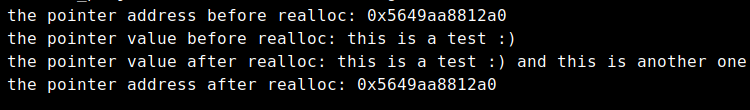

# Dynamic Memory Allocation

## Sum up

```
int *pnumber = (int*)malloc(25*sizeof(int));
int *pnumber = (int*) calloc(25, sizeof(int));
ptr = realloc(ptr, 25 * sizeof(int));

free(pnumber);
pnumber = NULL;
```

#### if we have a program that is designed to read in a set of data from a file into an array in memory we have three choices:

1. define the array to contain the maximum number of possible elements at compile time. int array\[1000];
2. use a variable-length array to dimension the size of the array at runtime int array\[a];
3. allocate the array dynamically using one of Cs memory allocation routing

## Heap and stack

### What is a Stack?

A stack is a special area of computer's memory which **stores temporary variables created by a function.** In stack, variables are declared, stored and initialized during runtime. **It is a temporary storage memory.** **When the computing task is complete, the memory of the variable will be automatically erased**. The stack section mostly contains methods, local variable, and reference variables.

### What is Heap?

The heap is a memory used by programming languages to store global variables. **By default, all global variable are stored in heap memory space**. **It supports Dynamic memory allocation.** The heap is not managed automatically for you and is not as tightly managed by the CPU. It is more like a free-floating region of memory.

## malloc

#### the simplest standard library function that allocates memory at runtime. need to include the stdlib.h header file

```
 #include <stdlib.h>
```

specify the number of bytes of memory that you want to allocate as the argument. returns the address of the first byte of memory that is allocated. because you get an address returned, a pointer is the only place to put it.

```
 int *pnumber = (int*)malloc(100);
```

request 100 bytes of memory and assign the address of this memory block to pnumber pnumber will point to the first int location at the 100 bytes that were allocated. can hold 25 int values on my computer, because they require 4 bytes each assumes that type int requires 4 bytes.


using malloc in this way is not always good because it might not work on different systems.


its better to remove the assumption that ints are 4 bytes and make sure our program works on any system architecture

```
 int *pnumber = (int*)malloc(25*sizeof(int));
```

this code will now work in different OSs and different architectures. 25sizeof(int) indicates that sufficient bytes for accommodating 25 values of type int should be made available so this value is chosen by the compiler on different systems.also notice the cast (int) which converts the address returned by the function to the type pointer to int.malloc returns a pointer of type pointer to void so we have to cast it.

if the memory that we request can not be allocated for any reason malloc() returns a pointer with the value NULL. it is always a good idea to check any dynamic memory request immediately using an if statement to make sure the memory is actually there before we try to use it.

example:

```
#include <stdlib.h>
int main(){
    int *pnumber = (int*)malloc(25*sizeof(int));
    if (!pnumber)
    {
        // code to deal with the memory shortage
    }
}
```

## Releasing the memory

**heap memory is automatically released after program exits.** a memory leak occurs when we allocate some memory dynamically and we don't retain the reference to it, so we are unable to release the memory. because we don't release the memory when we no longer need it, the program consumes more and more of the available memory on each loop iteration and eventually may occupy it all ! to free memory that we have allocated dynamically we must still ave access to the address that references the block of memory.

to release the memory for a block of dynamically allocated memory whose address we have stored in a pointer:

```
free(pnumber);
pnumber = NULL;
```

## calloc

offers a couple of advantages over maloc() it allocates memory as a number of elements of a given size it initializes the memory that is allocated os that all bytes are zero

requires two arguments 1. number of data items for which space is required 2. size of each data item

#### is declared in the stdlib.h header

```
int *pnumber = (int*) calloc(75, sizeof(int));
```

the return value will still be NULL if it was not possible to allocate the memory requested very similar to using malloc() but the big plus is that we know the memory area will be initialized to 0

## realloc

enables us to reuse or extend memory that we previously allocated using malloc() or calloc()

#### expects two arguments: 1. a pointer containing an address taht was previously returned bt a call to malloc(), alloc() 2. the size in bytes of the new memory that we want to allocate

allocates the amount of memory we specify by the second argument transfers the content of the previously allocated memory referenced bt rhe pointer that you supply as the first argument to the newly allocated memory returns a void\* pointer to the new mamory or NULL if the operation fails for some reason

#### realloc() preserves the contents of the original memory area

```
 ptr = realloc(ptr, n * sizeof(int));
```

example:

```
char *str;
str = (char*)calloc(25, sizeof(char));

strcpy(str,"this is a test :)");

printf("the pointer address before realloc: %p\n",str);
printf("the pointer value before realloc: %s\n",str);

str = (char*)realloc(str, 30* sizeof(char));
strcat(str," and this is another one");
printf("the pointer value after realloc: %s\n",str);
printf("the pointer address after realloc: %p\n",str);
free(str);
```

the output is this:



now we are using the same memory address for new data


avoid allocating lots of small amounts of memory. allocating memory on heap carries some overhead with it allocating many small blocks of memory will carry much more overhead than allocating fewer larger blocks

