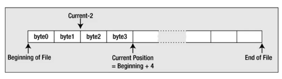

# Files

## File Handling Functions in C

this is a full list of all native C API functions for handling files \(including I/O functions\). most of these are just wrappers for more simple functions which are also included in the list. to have a better understanding of each function and the differences between its a good practice to try all of them in different forms and situations.

in this section i have gathered some of the most used and most important C file functions that you will face a lot.


| File handling functions | Description |
| :--- | :--- |
| fopen \(\) | fopen \(\) function creates a new file or opens an existing file. |
| fclose \(\) | fclose \(\) function closes an opened file. |
| getw \(\) | getw \(\) function reads an integer from file. |
| putw \(\) | putw \(\) functions writes an integer to file. |
| fgetc \(\) | fgetc \(\) function reads a character from file. |
| fputc \(\) | fputc \(\) functions write a character to file. |
| gets \(\) | gets \(\) function reads line from keyboard. |
| puts \(\) | puts \(\) function writes line to o/p screen. |
| fgets \(\) | fgets \(\) function reads string from a file, one line at a time. |
| fputs \(\) | fputs \(\) function writes string to a file. |
| feof \(\) | feof \(\) function finds end of file. |
| fgetchar \(\) | fgetchar \(\) function reads a character from keyboard. |
| fprintf \(\) | fprintf \(\) function writes formatted data to a file. |
| fscanf \(\) | fscanf \(\) function reads formatted data from a file. |
| fputchar \(\) | fputchar \(\) function writes a character onto the output screen from keyboard input. |
| fseek \(\) | fseek \(\) function moves file pointer position to given location. |
| SEEK\_SET | SEEK\_SET moves file pointer position to the beginning of the file. |
| SEEK\_CUR | SEEK\_CUR moves file pointer position to given location. |
| SEEK\_END | SEEK\_END moves file pointer position to the end of file. |
| ftell \(\) | ftell \(\) function gives current position of file pointer. |
| rewind \(\) | rewind \(\) function moves file pointer position to the beginning of the file. |
| getc \(\) | getc \(\) function reads character from file. |
| getch \(\) | getch \(\) function reads character from keyboard. |
| getche \(\) | getche \(\) function reads character from keyboard and echoes to o/p screen. |
| getchar \(\) | getchar \(\) function reads character from keyboard. |
| putc \(\) | putc \(\) function writes a character to file. |
| putchar \(\) | putchar \(\) function writes a character to screen. |
| printf \(\) | printf \(\) function writes formatted data to screen. |
| sprinf \(\) | sprinf \(\) function writes formatted output to string. |
| scanf \(\) | scanf \(\) function reads formatted data from keyboard. |
| sscanf \(\) | sscanf \(\) function Reads formatted input from a string. |
| remove \(\) | remove \(\) function deletes a file. |
| fflush \(\) | fflush \(\) function flushes a file. |

## File Structure in C



#### in C each file as a continuous sequence of bytes ending with an EOF \(end of file \) indicator. 

#### the current position is where any file action \(read/write\) will take place we can move the current position to any point in the file \(even the end\)

#### a text file is written as a sequence of characters organized as lines \(each line ends with a newline\)

#### binary data is written as a series of bytes exactly as they appear in memory image data,music, video, not readable

##  Accessing Files

#### fopen\(\) is defined in stdio.h header

```text
FILE *fopen(const char* restrict name, const char *restrict mode);
```

#### first arg is a pointer to a string that is the name of the external file.

the second arg is a character string that represents the file mode and specifies what you want to do with the file, a file mode specification is a character string between double quotes


#### if the file doesn't exist FILE will return NULL;

##  Write mode

example:

```text
   FILE *pfile = NULL;
    char *filename = "myfile.text";
    pfile = fopen(filename, "w"); // open myfile to write it
    if (pfile == NULL)
        printf("Failed to open file %s\n",filename);
}

```

## Append mode

```text
 pFile = fopen("myfile","a");
```

#### don't forget to check the value for NULL each time.

## Read mode

```text
pFile = fopen("myfile","r");
```

## Renaming a file

```text
int rename(const char *oldname, const char *newname)
```

the integer that is returned will be 0 if the name change was successful nd nonzero otherwise

the file must not be open while renaming

```text

if (rename("filename", "new_filename"))
    printf("failed to open file");
else
    printf("file renamed successfully"); 
```

## Closing a file

flose\(\) accepts a file pointer as an integer returns EOF \(int\) if an error occurs

if EOF was 0 the operation was successful

```text
fclose(pfile); 
pfile = NULL;
```

## Deleting a file

remove\(\) declared in stdio.h header

```text
 remove("myfile");
```

## Reading characters from a text file

#### fgetc\(\) takes a file pointer as its only arg and returns the character read as type int

#### int mchar = fgetc\(pfile\);

#### the mchar is type int because EOF will be returned if the end of the file has been reached

function getc\(\) is available as well, it gets an argument of type FILE\* and returns the character read as type int virtually identical to fgetc\(\) only difference between them is that getc\(\) may be implemented as a macro whereas fgetc\(\) is a function

we can read the content of a file again when necessary the rewind\(\) function positions to the file that is specified by the file pointer argument at the beginning

#### rewind\(pfile\);

```text
// read the whole file
int main() {

FILE *fp;
int c;

fp = fopen("test","r");

if (fp == NULL) {
    perror("error in openning file");
    return(-1);
}

while((c = fgetc(fp)) != EOF)
        printf("%c", c);

fclose(fp);
fp = NULL;
return 0;
 }
```

## Reading a string from a text file

#### we can use the fgets\(\) function to read from any file or stream

#### char _fgets\(char_ str, int nchars, FILE \*strean\)

the function reads a string into the memory area pointed to by str, from the file specified by stream , characters are read until either a '\n' is read or nchars-1 characters have been read from the stream whichever occurs first.

if a newline character is read its retained in the string, a '\0' character will be appended to the end of the string

if there is no error fgets\(\) returns the pointer, str if there is an error, NULL is returned reading EOF causes NULL to be returned

```text
 // read 60 characters of a file
 FILE *fp;
char str[60];
fp = fopen("test","r");
if(fp == NULL){
    perror("error opening file");
    return -1;
}

if (fgets(str, 60, fp)!= NULL){
    printf("%s",str);}

fclose(fp);
fp = NULL;
```

## Reading formatted input file

#### fscanf\(\)

#### int fscanf\(FILE _stream, const char_ format, ...\)

the first argument to this function is the format a C string that contains one or more of the following items: • white space character • non-white space character • format specifiers • usage is similar to scanf but from a file

#### function returns the number of items successfully matched and assigned

```text
FILE *fp;
char str1[10], str2[10], str3[10];
int year;

fp = fopen("test","w+");
if (fp != NULL)
    fputs("A B C ",fp);   // writing data to the file

rewind(fp);
fscanf(fp, "%s%s%s%d", str1, str2, str3, &year);  // reading parameters  from the file

printf("read string1: %s\n",str1);
printf("read string2 %s\n",str2);
printf("read string3 %s\n",str3);
printf("read integer %d\n",year);
fclose(fp);
```


## Writing characters to a text file

the simplest write operation is fputc\(\) writes a single character to a text file

first arg is the character to write, second one is the file pointer returns the character that was written if successful returns EOF if failure

#### putc\(\) is the same as fputc\(\) but its a macro.

```text
 FILE *fp;
int ch;
fp = fopen("test","w+");

for (ch = 33; ch<=100; ch++){  //write some ascii values
    fputc(ch,fp);}
    
fclose(fp);
```

##  Writing a string to a text file

#### fputs\(\)

#### int fputs\(const char  _str; FILE_  pfile\);

first argument is a string pointer and second is a file pointer

will write characters from a string until it reaches a '\0' character. doesnt write the null terminator character to the file can complicate reading back variable-length strings from a file that have been written by fputs\(\)

expecting to write a line of text that has a newline character at the end

```text
 FILE *fp;

fp = fopen("test","w+");

fputs("this is a test\n",fp); // \n character is important if you separate lines
fputs("another line here\n",fp);
fclose(fp);
```

##  Writing formatted output to a file

#### fprintf\(\)

#### int fprintf\( FILE _stream, const char_ format,...\)

the first arg is file pointer, second is the format a C string that contains one or more of these items:

 • whites paces 

• non-whites paces

 • format specifiers


usage is similar to printf but to a file if successful the total number of characters written is returned otherwise a negative number is returned

```text
#include <stdio.h>
#include <stdlib.h>

int main() {

FILe *ptr;
ptr = fopen("test","w+");
fprintf(ptr, "%s%s%s%s %d","hello","my","number","is",543);
fclose(fp);

return 0;
}
```

##  I/O functions

```text
<stdio.h>
 
 int fclose(filePtr) → close the file
 
 int feof(filePtr) → returns nonzero if the identified file has reached the end of the file and returns zero otherwise.
 
 int fflush(filePtr)  → flushes any data from internal buffers to the indicated file, returns zero on success and the value of EOF if an error occurs
 
 int fgetc(filePtr) → returns the next character in the file identified by the file pointer. the value of EOF if file an error occurs.
 
 int fgetpos(filePtr, fpos) →  gets the current file position, stores it into fpos_t (defined in stdio.h) variable pointed to by fpos.returns zero on success.
 
 char *fgets(buffer, i, filePtr) → reads characters from the indicated file until either i-1 characters are read or a newline character is read.
 
 FILE *fopen(fileName,accessMode) → open a file
 
 int fprintf (filePtr, format, arg1, arg2,...,argn) → writes spcecified args to the file identified by filePtr, according to the format specified.
 
 int fputc(c, filePtr) → writes the value of c to the file .returns c if successful and the EOF otherwise
 
 int fputs(buffer, filePtr) → writes the characters in the array pointed to by buffer to the indicated file until the terminating null character in buffer is reached
 
 int fscanf(filePtr, format,arg1,arg2,...,argn) →  reads data items from a file
 
 int fseek(filePtr,fpos) → sets the current file position for the file associated with filePtr to the value pointed to by fpos, which is of type fpos_t. returns zero on success and nonzero on failure
 
 long ftell(filePtr) → returns the relative offset in bytes of the current position in the file, or -1L on error
```

##  Reposition file stream with fseek

The C library function int fseek\(FILE \*stream, long int offset, int whence\) sets the file position of the stream to the given offset.


example read the whole file:

```text
#include <stdio.h>
#include <stdlib.h>

int main(){
FILE *f = fopen("test", "rb");
fseek(f, 0, SEEK_END);
long fsize = ftell(f);
fseek(f, 0, SEEK_SET);  /* same as rewind(f); */

char *string = malloc(fsize + 1);
fread(string, 1, fsize, f);
printf("%s",string);
fclose(f);

string[fsize] = 0;}

 
 example move file pointer position:
 
 #include <stdio.h>

int main () {
    FILE *fp;

    fp = fopen("file.txt","w+");
    fputs("This is tutorialspoint.com", fp);

    fseek( fp, 7, SEEK_SET );
    fputs(" C Programming Language", fp);
    fclose(fp);

    return(0);
}

```

## Writing/reading integer to a file

```text
#include <stdio.h>

int main ()
{

    FILE *fp;
    int i=1, j=2, k=3, num;
    fp = fopen ("test","w");
    putw(i,fp);
    putw(j,fp);
    putw(k,fp);
    fclose(fp);

    fp = fopen ("test","r");

    while(getw(fp)!=EOF)
    {
        num= getw(fp);
        printf("Data in test.c file is %d \n", num);
    }
    fclose(fp);
    return 0;
}
```

## Flushing a file

```text
#include <stdio.h>
int main()
{
FILE *fp;
fp = fopen("test","w+");
fflush(fp);
    return 0;
}
```


