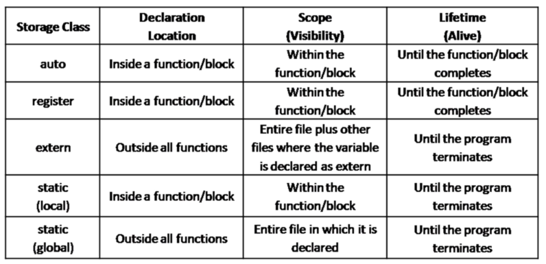

# Type Qualifiers

##  const

#### means the variable will not be changed by the program <a id="const-means-the-variable-will-not-be-changed-by-the-program"></a>

```text
 const int z =10;
```

## Volatile

#### volatile means that the variable will change its value so tells the compiler to suppress various kinds of optimizations \(e.g: caching\).

#### only three types if variables should use volatile:

* memory-mapped peripheral registers
* global variables modified  by an interrupt service routine 
* global variables accessed by multiple tasks within a multi-threaded application

```text
volatile int z; 
vloatile int * z;
```

##  restrict

#### an optimization hint for the compiler  the compiler can choose to ignore it  used in pointer declarations as a type qualifier for pointers  tells the compiler that a particular pointer is the only reference to the value it points to throughout its scope, the same value is not referenced but any other pointer or variable within that scope  without the restrict keyword the compiler has to assume the worst case that some other identifier night have changed the data in between two uses of a pointer   with restrict the compiler is free to look for computational shortcuts 

```text
 int * restrict pointer;
```

example:

```text
#include <stdio.h>
#include <malloc.h>

int main(void) {


    int n;
    int array[10];
    int * restrict  restar = (int*)malloc(10* sizeof(int));
    int *ptr = array;

    for (n = 0; n < 10 ;n++){
        ptr[n] +=5;
        restar[n] += 5;
        array[n] *=2;
        ptr[n] += 3;
        restar[n] += 3;
    }
};

```


## Storage Classes



storage classes are used to describe the features of a variable / function. include the scope, visibility and life-time. it helps up to trace the existence of a particular variable during the runtime of a program.

the lifetime of a variable is the time period during which variable exist in the memory.

the scope is where the variable can be referenced in a program.

a variables visibility or linkage determines for a multiple-source-file program whether the identifier is known only in the current source or in any source file with proper declarations

#### C provides 4 storage classes: 

1. **auto** 
2. **register** 
3.  **extern** 
4.  **static**

#### the 4 classes can be split into 2 storage duration:

#### 1.automatic storage duration 

#### 2. static storage duration

## auto storage class

created when the block in which they are defined is entered, exits while the block is active, destroyed when the block is exited

all local variables have auto storage duration by default.

its better not to use auto as a storage-class specifier in c/c++.

```text
 auto int var;
```

## external variables

functions contained in separate files can communicate through external variables, an extension to the concept of global variable

a global var can be accessed and changed by other modules \(files\)

in the module that wants to access the external variable the data type is preceded with the key word extern in the declaration, tells the compiler that a globally defined variable from another file is to be accessed

example: we have a var called moveNumber to access it in other functions we can define it as a global var outside any function:

```text
 int moveNumber = 0;
```

to access this var from another file use:

```text
 extern int moveNumber;
```

## static variables

we might want to define a var that is global but not external. to do this we use a static variable definition. if the below declaration is made outside any function it makes the value of the variable accessible from any subsequence pointed in the file in which the definition appears and not functions contained in other files.

```text
 static int moveNumber = 0;
```

## register

we can store variables of any kind in CPU registers as well which is much faster than RAM. this should be used only or variables that require quick access. it is the compilers choice to put it in a register or not.. it might be stored in a register depending on hardware and implementation restrictions.

the max variable size is equal to the register size. the variable life-time is within the block. we cant obtain the address of a register variable using a pointer, there is no memory address.

```text
 register int x;
```


