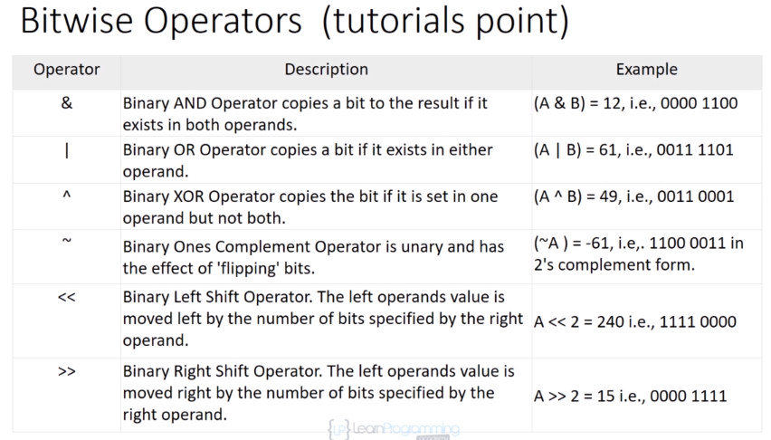

# ⭕ Data Types

## Integer

\
**int** → 4\
float → 12.585, -.0001 ( stores less values than double)\
double → same as float but stores twice the precision


**to explicitly express a float constant, append either an f or F to the end of the number: 12.54f**


## Boolean

#### boolean data type for storing 0 or 1 values. used for on/off, yes/no, true/false situation (binary choices)

**\<stdbool.h>** → include it to use bool instead of \_Bool

**bool** → substitute name for the basic \_Bool data type:

`true: 1`

`false: 0`

\_Bool → \_Bool var = 1

or we can do: \_Bool y = 1; \_Bool n = 0;

```
#include <stdbool.h>
bool var = true;   

or we can do:
    _Bool y = 1;
    _Bool n = 0;


or use preprocessors (have to include stdbool header ):

#define true 1
#define false 0

#define yes true
#define no false
```

## Boolean in Conditional Loops

#### this definition of true and false in boolean types is also applicable when we are using it in loops like a while loop. for example with when we want to use an infinite loop we can set the statements in a while(1) block:

```
while(1) or while(any non-zero integer)
{ 
    // loop runs infinitely
}
```

we can use any other positive or negative number instead of 1 in the loop. for example -255 or 10 or 735 are all the same and create a while loop. but using 0 will make the loop a false condition and it will always be false:

```
while(0)
{ 
    // loop does not run, code in this section will never be reached
}
```

## size\_t

**size\_t** → used to represent the size of objects in bytes and is therefore used as the return type by the sizeof operator. size\_t is a type guaranteed to hold any array index. only for non-negative values

```
size_t s1 = strlen(str1);
printf("%zu", s1);
```

## wchar\_t

**wchar\_t** → Wide char is similar to char data type, except that wide char take up twice the space and can take on much larger values as a result. char can take 256 values which corresponds to entries in the ASCII table. On the other hand, wide char can take on 65536 values which corresponds to UNICODE values which is a recent international standard which allows for the encoding of characters for virtually all languages and commonly used symbols.

example:

```
#include <stdio.h>
#include <stdlib.h>

int     main(void)
{
    wchar_t     *s;

    s = (wchar_t *)malloc(sizeof(wchar_t) * 2);
    s[0] = 42;   // ascii code for *
    s[1] = 115;   // ascii code for 's'
    printf("%ls\n", s);
    free(s);
    return (0);
}
```

## Enum Type

#### They are arithmetic types and they are used to define variables that can only assign certain discrete integer values throughout the program.

```
enum var { value1, value2, value3 };
```

#### the compiler actually treats enumeration identifiers as integer constants. first name in list is 0

```
enum month thisMonth;
thisMount = February;
```

#### the value 1 is assigned to thisMonth and not the name February because it is the second identifier listed inside the enumeration list

#### if you want to have a specific integer value associated with an enumeration identifier the integer can be signed to the identifier when the data type is defined.

```
enum direction { up, down, left=10, right};
                 1    2     10        11
```

#### an enumerated data type direction is defined with the values up,down,left,right up = 0 because it appears first in the list down = 1 cause its next left = 10 cause we said so right = 11 cause it appears immdeiatly after left in the list

## char

#### represents a single character such as the letter 'a'. always uses single quotes.

**char var;** → a single character

```
var='t';
```

#### char grade = 65; → is valid for ASCII code but not recommended

## Escape Characters

```
 \a → alert
 \b  → backspace
 \f → form feed
 \n → new line
 \r → carriage  return
 \t → horizental tab
 \v → vertical tab
 \\ → backslash \
 \' → single quote
 \" → double quote
 \? → question mark ?
 \0oo → octal value. o represents an octal digit
 \xhh → hexadecimal value. h represents a hexadecimal digit
```

## Data Type Conversion Functions

```
 double a = atof(s) →  converts the string into a floating-point number, returning the result
 
 int a = atoi(s) → converts the string into an int, returning the result
 
 int a = atol(s) → converts the string into a long int, returns result
 
 int a = atoll (s) → converts string into long long int, returns result 
```

## Printing Format Strings


## Complex Numbers

a complex number is a number of the form A + Bi is is the square root of minus one (imaginary) a and b are real numbers

C11 doesn't support complex numbers so it implements the macro **STDC\_NO\_COMPLEX** in the header section

to test whether your compiler supports complex or not:

```
#ifdef __STDC_NO_COMPLEX__
printf("complex arithmetic is not supported");
#else
printf("complex is supported");
#endif
```

declaring complex numbers:

```
 double _Complex ;
 float_Complex;
 long double_Complex;
```

if we include the complex.h header we can do it this way:

```
 double complex z1;
```

## Complex Functions

**creal()** → returns the real part of a value of type double complex that is passed as the argument

**cimage()** → returns the imaginary part

```
 double real_part = creal(z1);
 double imag_part = cimage(z1);
```

we append an f to these functions names when we are working with float complex values ( crealf() and cimagef()) and a lowercase l when using with long complex ( creall() and cmagl())

**conj()** → returns the complex conjugate of its double complex

**conjf() and conjl()** → return the complex conjugate for the other two types long and float

## Imaginary Numbers

we can use \_imaginary keyword to define variables that store purely imaginary numbers.

```
  double _Imaginary ix = 2.4*l;
  float_Imaginary;
```

if we include the complex.h header we can do it this way:

```
 double imaginary ix = 2.4*l
```

## typedef

#### a keyword that allows us to create our own name for an existing data type. defines the name counter to be equal to the C data type int. now variables can be declared of type counter:

```
 typedef int counter;
```

## Operators

```
+ → add  
 - → subtract
 * → multiply
 / → divide
 % → remainder of division
 ++ → increment by one
 -- → decrement by one
 = → simple assign operator
 += → add and assign
 -= → subtract and assign
 *= → multiply and assign
 /= → devide and assign
%= → modulus and assign
<< → left shift operator, i.e: 1 << 0 == 2 to the power of 0 == 1 == binary 0001
 >> → right shift operator
 >>= → right shift and assign
 <<= → left shift and assign
 &= → bitwise and assign
 ^= → bitwise exclusive or and assign
|= → bitwise inclusive or and assign
```



example:

```
#include <stdio.h>
int main(){
    unsigned int a = 60; // 0011 1100
    unsigned int b = 13; // 0000 1101
    int result = 0;
    int c = a & b; // 0000 1100
    printf("result : %d", c);
    return 0;
}
```

## Difference between x++ and ++x

\++x happens prior to assignment (per-increment), but x++ happens after assignment (post-increment). x++ executes the statement and then increments the value. ++x increments the value and then executes the statement.

## logical Operators

**&&** → AND operator, if both are non-zero the condition is true (A && B) is false

**||** → OR operator, if any or both are non-zero the condition is true (A || B) is true

**!** → NOT operator, reverse the logical statement !(A && B) is true

```
 (A || B) ? printf("true") : printf("false");
 (A && B) ? printf("true") : printf("false");
```
