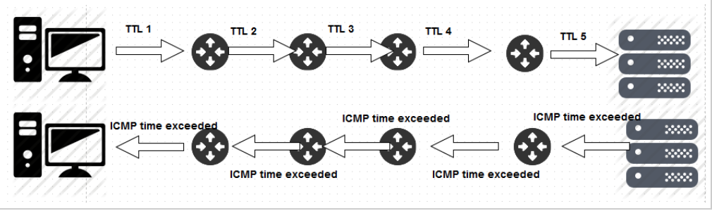
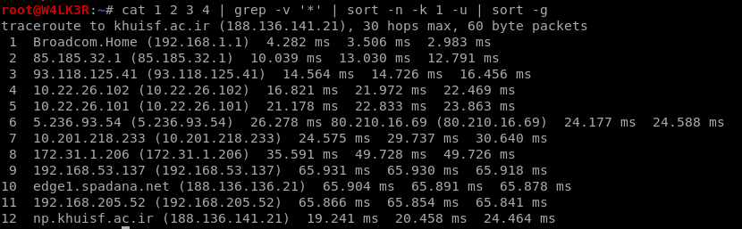
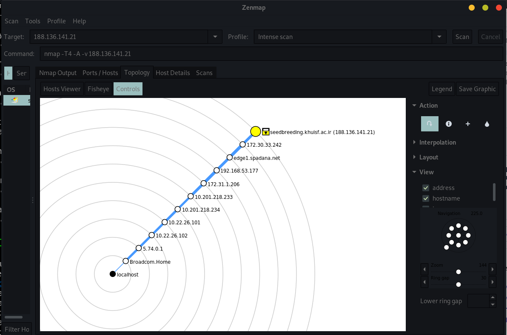

# ⭕ Host Discovery / Network Mapping

## <mark style="color:red;">Remote Discovery</mark>

you can use nmap, masscan or unicorn scan for this:

```
nmap -sn -T4 -oG 192.168.1.1/24 | grep “Status: Up” | cut -f 2 -d ‘ ‘ > LiveHosts.txt
nmap –PE –sn -n 10.50.96.0/23 –oX /root/Desktop/scan.xml
```

the `-PE` enables ICMP Echo request host discovery (Ping scan)

&#x20;the `-sn` option means only do a host discovery and not a port scan

```
unicornscan 192.168.100.35/24:31
masscan 192.168.2.1/24 -p80,53,443,22
```

masscan is the fastest host discovery tool available, even faster than nmap.

### <mark style="color:orange;">Extracting Live IPs from Nmap Scan</mark>

```bash
nmap 10.1.1.1 --open -oG scan-results; cat scan-results | grep "/open" | cut -d " " -f 2 > exposed-services-ips
```

## <mark style="color:red;">Local Discovery</mark>

### <mark style="color:orange;">Netdiscover</mark>

Discover live hosts in LAN and get the internal IP address and MAC address of live hosts in the network.It can be used in both active and passive mode.

```
netdiscover -i [interface]
```

#### Options:

```
  -i device: your network device
  -r range: scan a given range instead of auto scan. 192.168.6.0/24,/16,/8
  -l file: scan the list of ranges contained into the given file
  -p passive mode: do not send anything, only sniff
  -m file: scan the list of known MACs and host names
  -F filter: Customize pcap filter expression (default: "arp")
  -s time: time to sleep between each arp request (miliseconds)
  -n node: last ip octet used for scanning (from 2 to 253)
  -c count: number of times to send each arp reques (for nets with packet loss)
  -f enable fastmode scan, saves a lot of time, recommended for auto
  -d ignore home config files for autoscan and fast mode
  -S enable sleep time supression betwen each request (hardcore mode)
  -P print results in a format suitable for parsing by another program
  -N Do not print header. Only valid when -P is enabled.
  -L in parsable output mode (-P), continue listening after the active scan is completed
```

#### <mark style="color:green;">Active Mode ( Run as an ARP scanner )</mark>

```
netdiscover -i eth0 -r 192.168.1.0/24
```

<mark style="color:green;">**Multiple Ranges from a File**</mark>

```
netdiscover -l <file containing ranges>
```

#### <mark style="color:green;">**Passive Mode ( Run as an ARP sniffer )**</mark>

```
netdiscover -p -r <range,optional>
```

#### <mark style="color:green;">Parsable Outputs</mark>

```
Syntax: netdiscover -P<parsable> -N<ommit headers>
Command: netdiscover-r 192.168.1.1/24 -PN
```

### <mark style="color:orange;">Responder</mark>

**A great discovery tool for Active Directory Environments**

```
responder -I eth0 -A # see NBT-NS, BROWSER, LLMNR requests without responding.
responder.py -I eth0 -wrf
```

### <mark style="color:orange;">Bettercap</mark>

Advanced MitM and sniffer tool.

```
bettercap -X --proxy --proxy-https -T <target IP>
# better cap in spoofing, discovery, sniffer
# intercepting http and https requests,
# targetting specific IP only
```


## <mark style="color:red;">Traceroute</mark>

discovers the route that packets take between two system in the network. it helps us to construct network architecture diagrams and it is included in most if not all OSs.

<mark style="color:orange;"></mark>

Windows:

```
tracert [target]
```

Linux:

```
traceroute [target] 
```

### <mark style="color:orange;">Linux traceroute</mark>

#### Linux traceroute sends packets to target with varying TTLs in the IP header. by default sends UDP packets with incrementing destination ports starting from port 33434 going up by one port for each probe packet sent ( each hope measured three times ).



#### here are some of the most used options:

```
-f [number]: set the initial TTL for the first packet
-g [host list] : specify a loose source route (8 maximum hops)
-I : use ICMP echo request instead of UDP
-T : use TCP SYN instead of UDP with deafult dest port 80
-m [number] : set the maximum number of hops
-n : print numbers instead of names
-p [port] : set port ( for UDP sets the base port and increment, for TCP its fixed port
-w [number] : wait for N seconds before giving up and writing * (default 5)
-4 : force use of IPv4
-6 : force use of IPv6
```

### <mark style="color:orange;">windows traceroute</mark>

#### sends ICMP echo request messages to target, starting with small TTLs.

some useful options:

```
-h [number] : max number of hops (default 30)
-d : dont resolve names
-j [hostlist] : use loose source routing with a space-separated list of router IPs (up to 9 max)
-w [number] : wait for N milliseconds before givving up and writing a * (default is 4000)
-4 : force use of IPv4
-6 : force use of IPv6
```

### <mark style="color:orange;">Web based traceroute services</mark>

#### instead of tracing from your address to target various websites allow you to trace from them to the target. so you can traceroute from around the world. by domain name or IP address. this is very useful in seeing if you are being shunned during a test.







## <mark style="color:red;">Network Mapping</mark>

### <mark style="color:orange;">Traceroute</mark>

for best performance and mapping the network hops use traceroute with these three options and compare the results:

```
traceroute target
traceroute -T target
traceroute -T -p [test multiple ports] target
traceroute -I target
```

for an all in one command you can use this chain of commands:

```
traceroute target.com > 1 && traceroute -T target.com > 2 && traceroute -I target.com > 3 && traceroute target.com -T 80 > 4 && cat 1 2 3 4 | grep -v '*' | sort -n -k 1 -u | sort -g
```

this will run a traceroute with multiple methods and combine the results for better view.



using this method we can minimize the chance of lost hopes in the route. ( the \* signs). here is the bash script you can use with the target domain or IP as an argument to perform the same task:

```
#!/bin/bash

if [ $# -ne 1 ]
        then
        echo "usage: $0 <target ip/domain>"
        exit 1
fi

echo "[*] Using UDP with incremental from 33434 "
traceroute $1 | tee -a tmp1
echo "[*] Using TCP SYN port 80"
 traceroute -T $1 | tee -a tmp2
echo "[*] Using ICMP echo request"
traceroute -I $1 | tee -a tmp3
echo "[*] Using TCP SYN port 443"
 traceroute $1  -T 443 | tee tmp4
echo
echo "[+] Multi-route finished [+]"
echo "[+] Results saved to $1.txt file [+]"
cat tmp1 tmp2 tmp3 tmp4 | grep -v '*' | sort -n -k 1 -u | sort -g | tee -a $1.txt
rm -rf tmp1 tmp2 tmp3 tmp4
```

### <mark style="color:orange;">Zenmap</mark>

you can also use zenmap for network mapping which is a GUI for nmap tool and can be downloaded from [here](https://nmap.org/zenmap/).


