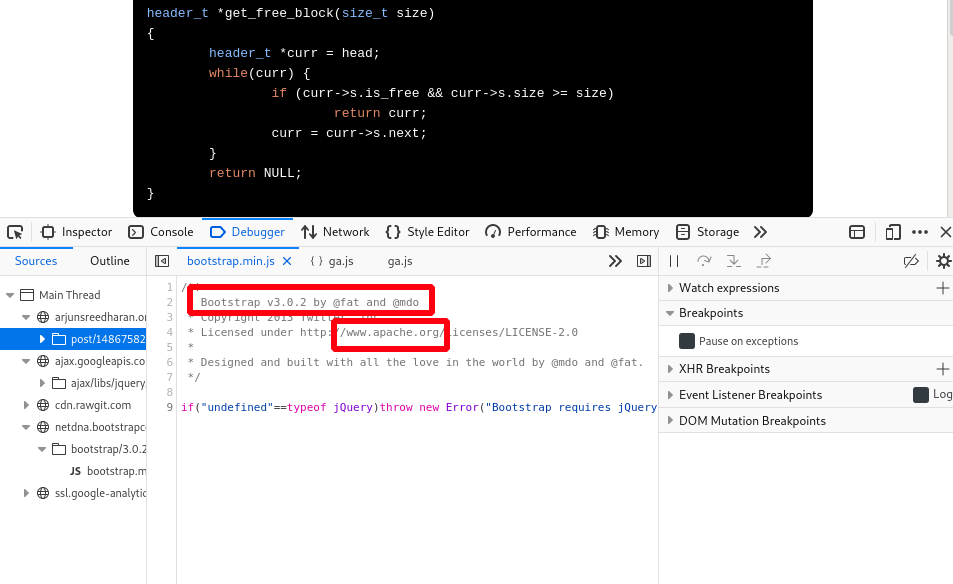
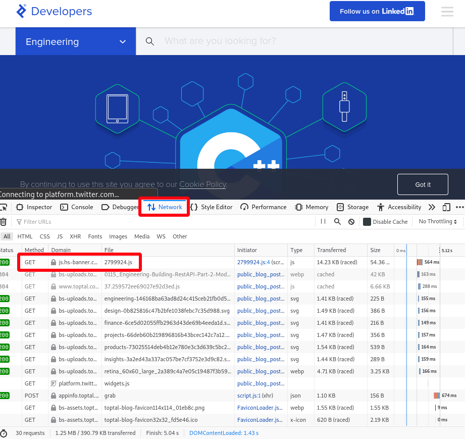
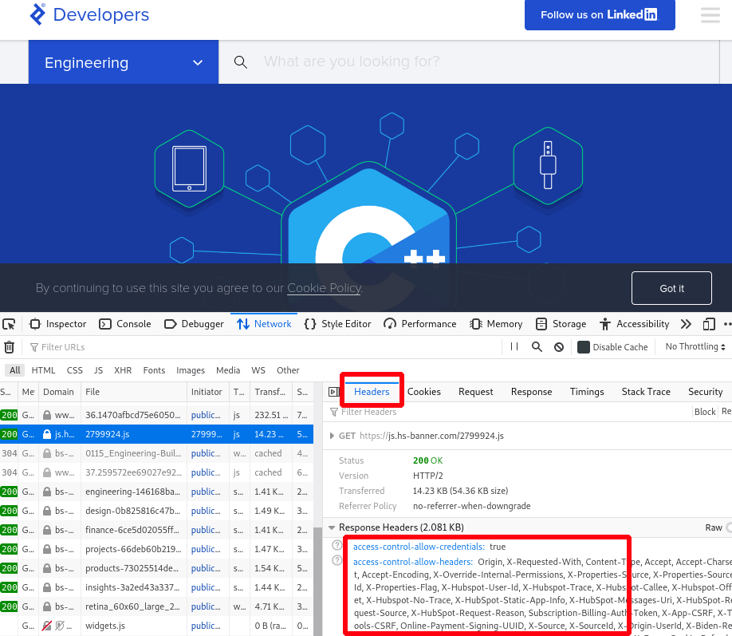

# \*⃣ Web Recon

## Manual Methods

File extensions, which are sometimes a part of a URL, can reveal the programming language the application was written in. Some of these, like .php, are straightforward, but other extensions are more cryptic and vary based on the frameworks in use. For example, a Java-based web application might use .jsp, .do, or .html.

However, file extensions on web pages are becoming less common since many languages and frameworks now support the concept of routes, which allow developers to map a URI to a section of code. Applications leveraging routes use logic to determine what content is returned to the user and make URI extensions largely irrelevant.

### Inspecting Page Content

press F12 , Although URL inspection can provide some clues about the target web application, most context clues can be found in the source of the web page. The Firefox Debugger tool (found in the Web Developer menu or by pressing Ctrl+Shift+K ) displays the page’s resources and content, which varies by application. The Debugger tool may display JavaScript frameworks, hidden input fields, comments, client-side controls within HTML, JavaScript, and much more.

### Viewing Response Headers

We can also search server responses for additional information. There are two types of tools we can use to accomplish this task. The first type of tool is a proxy, which intercepts requests and responses between a client and a webserver. We will explore proxies later in this module, but first we will explore the Network tool, launched from the Firefox Web Developer menu, to view HTTP requests and responses. This tool shows network activity that occurs after it launches, so we must refresh the page to see traffic.

We can click on a request to get more details about it, in this case the response headers:

