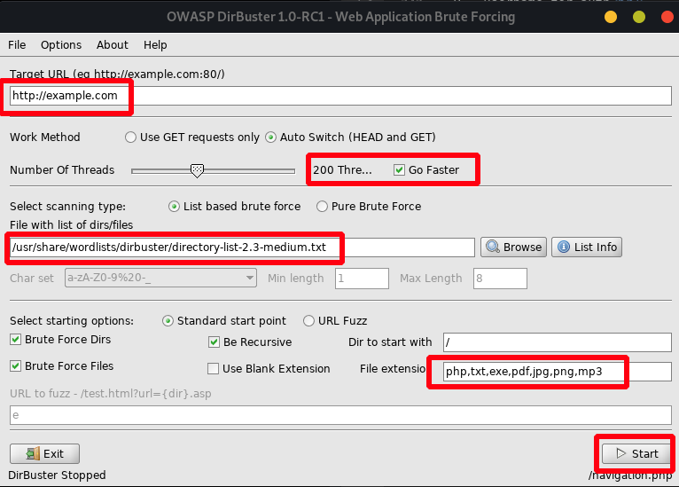

# Web Application Enumeration

## Finding Hidden Virtual Hosts/Subdomains

certificate transparency reports offer a penetration tester an additional method for discovering hosts and subdomains within a domain. this includes hidden virtual hosts that are not linked publicly and google doesn't know about them but they have been issued an x.509 cert. use these links for cert discovery:





#### here is a simple bash script i wrote to automate the subdomain enumeration task. it uses various online resources to discover every subdomain that is publicly available.



## Test SSL certs

Not really important as an attack vector but its something you should definitely include in your report. since the SSL rating of the target organization website is valuable to the customers/partners and can be a problem from business aspects.



```text
nmap -p 443 --script=ssl-enum-ciphers target.com
```

## Directory and Subdomain Discovery

### sublist3r

```text
sublist3r -d [domain] -t [threads] -o [output] -v -b [brute force mode>]
```

### DIRB

```text
dirb http://example.com -r
```

### dirsearch

one of the best tools for discovering sub-directories and metadata search. 



```text
python3 dirsearch.py -u http://192.168.56.103 -e php,exe.elf.cgi,asp,txt,pdf,png,jpg -r --suppress-empty -t 5 --clean-view -w db/dicc.txt -x 403,404 
```

### patator

```text
patator http_fuzz url=[url] method=POST body
```

### gobuster

Used for both subdomain/vhost and subdirectory discovery.

```text
gobuster dir -w /usr/share/wordlists/dirb/directory-list-2.3-medium.txt -u 10.10.10
```

some useful options:

```text
-x → extention
dir → directory brutforce
dns → subdomain bruteforce
-c → cookie string
-e → print full url
-U → username for auth
-p → password for basic auth
-P → proxy [http(s)://host:port]
-s → set positive status codes will be overwritten with statuscodesblacklist if set) (default "200,204,301,302,307,401,403")
-u → url
-o → output to a file
-k → skip ssl
-a → set user agent
```

#### GoBuster Web Content Discovery

```text
gobuster -u http:/// -w /usr/share/seclists/Discovery/ Web_Content/common.txt -s '200,204,301,302,307,403,500' -e
```

#### GoBuster subdomain brute forcing

```text
gobuster dns -w /usr/share/seclists/Discovery/ DNS/subdomains-top1million-110000.txt -d target.com
```

#### GoBuster subdomain vhost search

```text
gobuster vhost -u example.com -w /usr/share/seclists/Discovery/Web-Content/directory-list-2.3-medium.txt 
```

### dirbuster

add url wtih port : example: [http://127.0.0.1:80/](http://127.0.0.1:80/) 

wordlist for bruteforce is in /usr/share/wordlists/dirbuster

 set go faster 200 threats \(usually works best\) in file extentions add any file type you want to look for like rar,docx,zip, etc.



### wfuzz

#### it can fuzz any given location in a url, the location is specified by the "FUZZ" parameter:

```text
wfuzz -u http://sneakycorp.htb -w /usr/share/wordlists/dirbuster/directory-list -2.3-small.txt -H 'Host: FUZZ.sneakycorp.htb' --hw 1
```

#### find files and extensions, Hide 404 codes:

```text
wfuzz -u http://10.10.15.205/firstdirc/seconddir/FUZZ.extension -w /usr/share/dirbuster/wordlists/directory-list-2.3-medium.txt -c --hc 404
```

## CMS scanning

### Wordpress

The WordPress version is shown in the "generator" meta tag \(unless removed by the site\). You may search the source code \(CTRL-F\) for "generator" to see the version. This curl command will also show it. The "-s" flag is for "silent"

```text
curl -s http://example.com/wordpress/ | grep generator
```

#### this will give you basic information about wordpress:

```text
wpscan --url https://192.168.26.141
```

#### this will give you information on vulnerable plugins:

```text
wpscan --url https://192.168.26.141:12380/blogblog --enumerate vp
```

#### check for exploits that match the version of wordpress:

```text
wpscan --no-update --url http://www.example.com/wordpress/
wpscan --no-update --url http://www.example.com/wordpress/ | grep Title
wpscan --no-update --url http://www.example.com/wordpress/ | grep Title | wc -l
```

#### vulnerability and plugin scan:

```text
wpscan --url sandbox.local --enumerate ap,at,cb,dbe
```

#### enumerate usernames

```text
wpscan --url http://192.168.56.149/wordpress/ --enumerate u --force --wp-content-dir wp-content
```

#### password attack on discovered usernames:

```text
wpscan --url http://192.168.56.149/wordpress/ --passwords /usr/share/wordlists/fasttrack.txt --usernames userlist -t 25
```

#### enumerate everything

```text
wpscan --url https://192.168.26.141
```

#### scan with nmap NSE scripts

```text
nmap -sV --script http-wordpress-enum 10.11.1.234
nmap -Pn --script http-wordpress-enum --script-args check-latest=true,search-limit=10 10.11.1.234
nmap -sV 10.11.1.234 --script http-wordpress-enum --script-args limit=25
```

### Drupal

#### droopscan

installation:

```text
apt-get install python-pip
pip install droopescan
```

scanning:

```text
droopescan scan drupal -u example.org        
droopescan scan -u example.org
droopescan scan -U list_of_urls.txt
```

### Joomla

#### joomscan

```text
joomscan --url http://192.168.56.126 -ec
```

## Nikto

A free web application vulnerability scanner preinstalled on kali linux.

```text
nikto -host example.com
```

## Other Methods

File extensions, which are sometimes a part of a URL, can reveal the programming language the application was written in. Some of these, like .php, are straightforward, but other extensions are more cryptic and vary based on the frameworks in use. For example, a Java-based web application might use .jsp, .do, or .html. 

However, file extensions on web pages are becoming less common since many languages and frameworks now support the concept of routes, which allow developers to map a URI to a section of code. Applications leveraging routes use logic to determine what content is returned to the user and make URI extensions largely irrelevant.

### Inspecting Page Content

press F12 , Although URL inspection can provide some clues about the target web application, most context clues can be found in the source of the web page. The Firefox Debugger tool \(found in the Web Developer menu or by pressing Ctrl+Shift+K \) displays the page’s resources and content, which varies by application. The Debugger tool may display JavaScript frameworks, hidden input fields, comments, client-side controls within HTML, JavaScript, and much more.


### Viewing Response Headers

We can also search server responses for additional information. There are two types of tools we can use to accomplish this task. The first type of tool is a proxy, which intercepts requests and responses between a client and a webserver. We will explore proxies later in this module, but first we will explore the Network tool, launched from the Firefox Web Developer menu, to view HTTP requests and responses. This tool shows network activity that occurs after it launches, so we must refresh the page to see traffic.


We can click on a request to get more details about it, in this case the response headers:


### A Little Tip for CTFs

its worth mentioning that in most online CTFs like hackthebox or tryhackme you will usually find some clues about the attack vector by just looking at the web page source code. however in a real-world scenario this is highly unlikely these days to find admin password in a comment inside the main page of a website.


