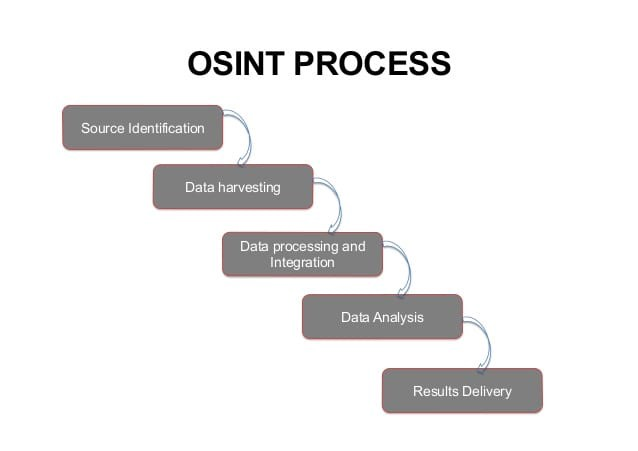
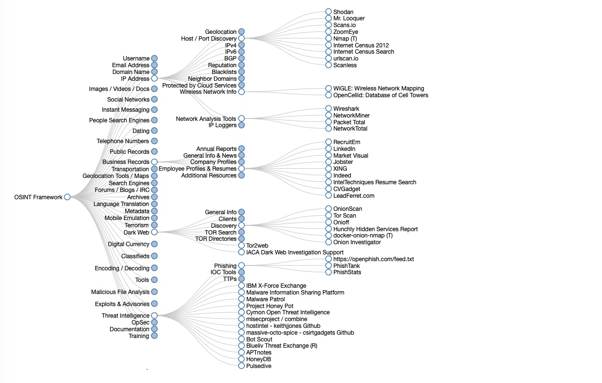

# Passive \(OSINT\)


#### OSINT is short for Open-Source Information Gathering, OSINT is a way of foot printing your target without any sorts of direct contact or leaving any evidence of the recon process.

#### simply put, OSINT means finding info without leaving any info. there are some ways to perform active info gathering without being traced for example using tor or double VPNs or even passive methods like using a public network but we will talk about those in the scanning phase, right now lets jump into some resources for OSINT.


besides OSINT there are other methods and techniques out there that are no longer used. there is an almost endless variety and number of sources available out there. **Signals Intelligence \(SIGINT\)** is no longer interesting or relevant since satellite communications are insignificant these days. **Image Intelligence \(IMINT\)** is something anybody can do with modern drones. Books are outdated and have been replaced with e-book readers and other mobile electronic devices. Overall, other communication channels have taken over, new kinds and types of sources pop up almost every day, many of those requiring technical skills to make use of them. Many, if not most, of the possible relevant sources are completely unknown to intelligence analysts. Finding and using sources is today’s task for specialists.

Due to the vast amounts of information available to sift through on the Web, attackers must have a clear and defined search framework as well as a wide array of OSINT collection tools to facilitate this task and assist with processing the data; otherwise they risk getting lost in the overwhelming sea of information that has become the Internet. 

### OSINT reconnaissance can be further broken down into the following 5 sub-phases:



**Source Identification**: as the starting point, in this initial phase the attacker identifies potential sources from which information may be gathered from. Sources are internally documented throughout the process in detailed notes to come back to later if necessary.

**Data Harvesting**: in this phase, the attacker collects and harvests information from the selected sources and other sources that are discovered throughout this phase.

**Data Processing and Integration**: during this phase, the attacker processes the harvested information for actionable intelligence by searching for information that may assist in enumeration.

**Data Analysis**: in this phase, the attacker performs data analysis of the processed information using OSINT analysis tools.

**Results Delivery**: in the final phase, OSINT analysis is complete and the findings are presented/reported to other members of the Red Team.

for example in the picture bellow you see a sample OSINT chart for a domain enumeration:


so first we start with well known sources and tools and then go for additional options:

## Maltego

is an open source intelligence \(OSINT\) and graphical link analysis tool for gathering and connecting information for investigative tasks. its preinstalled in kali linux. you can download it from [here](https://www.maltego.com/)


## Google Hacking


also named Google dorking, is a hacker technique that uses Google Search and other Google applications to find security holes in web applications, finding loots, targeting databases, login pages or even exposed backup files and directories.

#### there is an expanding database of these search queries maintained by offensive security folks called the [google hacking database \(GHDB\) ](https://www.exploit-db.com/google-hacking-database). you can use the site search to find dorks for specific types of targets. 

besides the google dorks which are more advanced, there are some google search tricks \(keywords\) that will make your life easier. these are the keywords used in advanced google search**e**s:

### **cache:** 

If you include other words in the query, Google will highlight those words within the cached document. For instance, \[cache:www.google.com web\] will show the cached content with the word “web” highlighted. This functionality is also accessible by clicking on the “Cached” link on Google’s main results page. The query \[cache:\] will show the version of the web page that Google has in its cache. For instance, \[cache:www.google.com\] will show Google’s cache of the Google homepage. Note there can be no space between the “cache:” and the web page url.

### **link:** 

The query \[link:\] will list webpages that have links to the specified webpage. For instance, \[link:www.google.com\] will list webpages that have links pointing to the Google homepage. Note there can be no space between the “link:” and the web page url.

**related:** The query \[related:\] will list web pages that are “similar” to a specified web page. For instance, \[related:www.google.com\] will list web pages that are similar to the Google homepage. Note there can be no space between the “related:” and the web page url.

### **info:** 

The query \[info:\] will present some information that Google has about that web page. For instance, \[info:www.google.com\] will show information about the Google homepage. Note there can be no space between the “info:” and the web page url.

### **define:**

 The query \[define:\] will provide a definition of the words you enter after it, gathered from various online sources. The definition will be for the entire phrase entered \(i.e., it will include all the words in the exact order you typed them\).

### **stocks:**

 If you begin a query with the \[stocks:\] operator, Google will treat the rest of the query terms as stock ticker symbols, and will link to a page showing stock information for those symbols. For instance, \[stocks: intc yhoo\] will show information about Intel and Yahoo. \(Note you must type the ticker symbols, not the company name.\)

### **site:** 

If you include \[site:\] in your query, Google will restrict the results to those websites in the given domain. For instance, \[help site:www.google.com\] will find pages about help within www.google.com. \[help site:com\] will find pages about help within .com urls. Note there can be no space between the “site:” and the domain.

### **allintitle:**

 ****If you start a query with \[allintitle:\], Google will restrict the results to those with all of the query words in the title. For instance, \[allintitle: google search\] will return only documents that have both “google” and “search” in the title.

### **intitle:** 

If you include \[intitle:\] in your query, Google will restrict the results to documents containing that word in the title. For instance, \[intitle:google search\] will return documents that mention the word “google” in their title, and mention the word “search” anywhere in the document \(title or no\). Note there can be no space between the “intitle:” and the following word. Putting \[intitle:\] in front of every word in your query is equivalent to putting \[allintitle:\] at the front of your query: \[intitle:google intitle:search\] is the same as \[allintitle: google search\].

### **inurl:**

 If you include \[inurl:\] in your query, Google will restrict the results to documents containing that word in the url. For instance, \[inurl:google search\] will return documents that mention the word “google” in their url, and mention the word “search” anywhere in the document \(url or no\). Note there can be no space between the “inurl:” and the following word. Putting “inurl:” in front of every word in your query is equivalent to putting “allinurl:” at the front of your query: \[inurl:google inurl:search\] is the same as \[allinurl: google search\].

#### and these are some simple rules for combining the queries and dorks as well:

OR : \( \| \)

AND: \(&\)

NOT

define : define a word or phrase


## Shodan


Search engine for the Internet of everything. Shodan is the world's first search engine for Internet-connected devices including computers, servers, CCTV cameras, SCADA systems and everything that is connected to the internet with or without attention. Shodan can be used both as a source for gathering info about random targets for mass attacks and a tool for finding weak spots in a large network of systems to attack and take the low-hanging fruit. Shodan has a free and commercial membership and is accessible at [shodan.io](www.shodan.io) . the search syntax in the search engine is somehow special and can be found in the help section of the website. with shodan you can search for specific systems, ports, services, regions and countries or even specific vulnerable versions of a software or OS service running on systems like SMB v1 and much more.

 here the keywords that are mostly used in shodan search queries:

```text
title: Search the content scraped from the HTML tag
html: Search the full HTML content of the returned page
product: Search the name of the software or product identified in the banner
net: Search a given netblock (example: 204.51.94.79/18)
version: Search the version of the product
port: Search for a specific port or ports
os: Search for a specific operating system name
country: Search for results in a given country (2-letter code)
city: Search for results in a given city
! : NOT
```

for example these are some queries you can use with these keywords:

```text
hostname:megacorpone.com
title:"smb" !port:139,445
product:IIS 8.5
Microsoft-IIS/5.0 title:"outlook web"
net:100.10.23.0/24 unauthorized
html:"eBay Inc. All Rights Reserved"
"Authentication: disabled" port:445
shodan count microsoft iis 6.0
shodan host 189.201.128.250
shodan myip
shodan parse --fields ip_str,port,org --separator , microsoft-data.json.gz 
shodan search --fields ip_str,port,org,hostnames microsoft iis 6.0
```

there are several other ways to use the search engine without the website for example with the nmap NSE scripts like this:

```text
  nmap -sn -Pn -n --script=shodan-api -script-args shodan-api.apikey=[api key] [target ip]
```

there is also a CLI shodan interface written in python for linux which you can use or integrate in your own scripts or tools. to install and setup the CLI tool:

```text
   pip install shodan
   shodan init <api key>
   shodan -h
```

you can use the CLI tool by simply specifying a single host/IP:

```text
shodan host [target ip]
```

shodan will return ports, services and even some possible CVEs  \( which are not very reliable \).

for the free API keys you cant use the same method to scan a whole net block but with some bash voodoo you can use the free API instead of paid ones to scan the whole /24 net block this way and see if any systems on this net block is exposed :

```text
for host in {1..254}; do shodan host 192.168.1.$host 2>&1 | grep -v "Error" ; done
```

and if you want to aggressively scan a /16 net block you can do this:

```text
 for netblock in {1..254};do for host in {1..254}; do shodan host 192.168.$netblock.$host 2>&1 | grep -v "Error" ; done ; done
```

and here are some other useful resources about shodan:

[https://www.sans.org/blog/getting-the-most-out-of-shodan-searches/](https://www.sans.org/blog/getting-the-most-out-of-shodan-searches/)  
[https://thor-sec.com/cheatsheet/shodan/shodan\_cheat\_sheet/](https://thor-sec.com/cheatsheet/shodan/shodan_cheat_sheet/)  
[https://github.com/jakejarvis/awesome-shodan-queries](https://github.com/jakejarvis/awesome-shodan-queries)

## OSINT Framework

[the OSINT framework](https://osintframework.com/) is a great collection of OSINT resources that you should definitely check them out.



## Websites and popular online OSINT sources

I have put together a list of the most used OSINT sources that will usually cover about 90% of your needs in  a a regular pentest, remember there are endless ways to find Intel about your target. the OSINT process is limited to your own imagination. 

### 1\) Top sources \( most used \)

#### [Skip Tracing Framework \(kind of all-in-one directory for recon\)](https://makensi.es/stf/)   [Robtex \(search for IPs, domain names, etc \)](https://www.robtex.com/)   [Netcraft \(very useful for website and domain recon\)](https://searchdns.netcraft.com/)   [SSL labs \(test websites and domains SSL cert security\)](https://www.ssllabs.com/ssltest)   [Security Headers \(test website headers \(browser plugin is available\)](https://securityheaders.com)   [Archive.org \(the largest Internet archive\)](https://archive.org/)   [iseek \(not as deep as others but still useful\)](https://www.iseek.com/)   [Global file search \(search for any file, used for passive metadata search \)](http://globalfilesearch.com/)   [NSLookup \(query DNS records, both web and CLI tool \)](https://network-tools.com/nslookup/)   [DNSdumpster \(greate for DNS recon\)](https://dnsdumpster.com/)   [Whois \(both web and CLI tool \)](https://www.whois.net)   [ONYPHE \(internet SIEM website, thats what they call themselves \)](https://www.onyphe.io/) 


### 2\) Image search

#### [TinEye \( reverse image search \)](https://tineye.com/)   [photo bucket \( image search \)](https://photobucket.com/)

#### 

### 3\) Username and people search

####   [User search \( earch for usernames, mostly social media networks \)](https://usersearch.org/)   [Thats them](https://thatsthem.com/)   [pipi \( investigation and research, you should sign up for it \)](https://pipl.com/)   [Social mention \( social media search \)](http://socialmention.com/)   [Social searcher \( social media search \)](https://www.social-searcher.com/)   [SPOKEO \( name, phone number, address, etc. \)](https://www.spokeo.com/)   [Find people search \( people search \)](http://www.findpeoplesearch.com/)   [Social bearing](https://www.socialbearing.com)   [TwimeMachine](https://www.twimemachine.com) 

#### 

### 4\) Metadata search

### [Archive.org](https://archive.org/)   [metapicz](http://metapicz.com/#landing)   [image forensic](http://www.imageforensic.org/)   [findexif](http://findexif.com/)   [exif regex](http://exif.regex.info/exif.cgi)

### 

### 5\) IOT and device search

#### [shodan \( search engine for internet connected devices, command line \)](https://www.shodan.io/)  [open stream cam \( open stream camera \)](file:///root/work/w4lk3rn3t/recon/osint/index.html)  [insecam \( live video camera search \)](file:///root/work/w4lk3rn3t/recon/osint/index.html)

####  

### 6\) Dark web engines

#### pubpeer.com

scholar.google.com

arxiv.org

guides.library.harvard.edu

deepdotweb.com

Core.onion

OnionScan

Tor Scan

ahmia.fi

not evil


### 7\) Monitoring and alerting

Google Alerts

HaveIBeenPwned.com

Dehashed.com

Spycloud.com

Ghostproject.fr

weleakinfo.com/



## Tools and Frameworks

#### There are countless number of tools out there designed for active/passive recon. in fact almost one out of then pentester/security "expert" out there has written some sort of crap recon framework/tool that only himself/herself has ever used. you wont need to know about every single one of them because most of them use the same techniques for gathering these information. in this section i will briefly introduce you to the best/well-known tools that i usually use:

## Theharvester

a well-known tool among pentesters and OSINT investigators which is mostly good for collecting subdomains and email addresses.



harvester is preinstalled on pentesting OSs like kali and parrot but for others you can install it from github and run it in docker:

```text
apt install theharvester
Theharvester --help
```

```text
git clone https://github.com/laramies/theHarvester
cd theHarvester
docker build -t theharvester .
docker run theharvester -h 
```

## h8mail

An email OSINT and breach hunting tool using different breach and reconnaissance services, or local breaches such as Troy Hunt's "Collection1" and the infamous "Breach Compilation" torrent.



```text
python3 -m pip install h8mail

h8mail -t target@example.com
```

## gitrob

a tool to help find potentially sensitive files pushed to public repositories on Github. Gitrob will clone repositories belonging to a user or organization down to a configurable depth and iterate through the commit history and flag files that match signatures for potentially sensitive files. The findings will be presented through a web interface for easy browsing and analysis.



## inspy

LinkedIn enumeration tool. preinstalled on kali.




```text
inspy --empspy /usr/share/inspy/wordlists/title-list-large.txt --emailformat flast@google.com 'Google'

--email format is how the emails work

inspy --empspy /usr/share/inspy/wordlists/title-list-large.txt --emailformat

```


## amass

In-depth Attack Surface Mapping and Asset Discovery, preinstalled on kali. The OWASP Amass Project performs network mapping of attack surfaces and external asset discovery using open source information gathering and active reconnaissance techniques.



run the help to see the options:

```text
amass --help
```

## spiderfoot

an open source intelligence \(OSINT\) automation tool. It calmes to integrate with just about every data source available and utilities a range of methods for data analysis, making that data easy to navigate.



```text
spiderfoot -l 127.0.0.1:5001  → run web GUI on local host, connect with browser
```

## recon-ng

By far, the best recon framework out there with both active and passive modules. designed like metasploit framework and each type of recon has its own specific module and options. the modules are installed from the "marketplace" plus a bunch of reporting modules for different formats. recon-ng is preinstalled on kali linux and parrot OS.



you can see the full ocumentation in the wiki:



here are some of the useful commands for a quick start:

```text
help >>> help
marketplace install/search/info [modules names] >>> add or search for a module
modules load [module] >>> load a module
info >>> show module options
options set >>> set module options
run >>> run the module
```

to install all recon modules at once:

```text
marketplace install recon/
```

some modules need api keys add it with :

```text
e.g: shodan for example keys add shodan_api <API>
show keys — list available API keys
keys add api_key_name #api_key_value →  add key to module
```

a list of modules i usually use:

```text
recon/domains-domains/brute_suffix 
recon/domains-hosts/bing_domain_web  
recon/domains-hosts/brute_hosts
recon/domains-hosts/netcraft
recon/domains-hosts/ssl_san
recon/hosts-hosts/bing_ip
recon/domains-hosts/hackertarget
recon/netblocks-hosts/reverse_resolve       → find hosts in a netblock
recon/hosts-hosts/reverse_resolve
discovery/info_disclosure/cache_snoop       → useful for finding AVs in use
```

## sherlock

find user accounts on social media



```text
git clone https://github.com/sherlock-project/sherlock.git

cd sherlock
python3 -m pip install -r requirements.txt
python3 sherlock --help
python3 sherlock user1 user2 user3
```

## TWINT

advanced Twitter scraping tool written in Python that allows for scraping Tweets from Twitter profiles without using Twitter's API.



## social-analyzer

for analyzing and finding a person's profile across +800 social media  websites

```text
python3 -m pip install social-analyzer

social-analyzer --username "johndoe" --metadata --extract --mode fast
```


